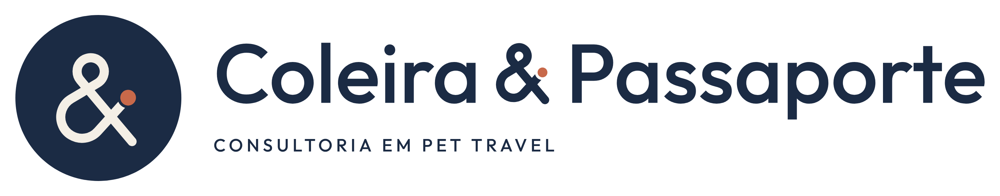

# Coleira & Passaporte · identidade visual

Proposta v1 · 30/09/2026 · consultoria em Pet Travel

Apresentação completa (três direções, recomendação, testes e regras):
[`apresentacao/coleira-passaporte-identidade.html`](apresentacao/coleira-passaporte-identidade.html)
(também em PNG e PDF na mesma pasta).

## Direção recomendada: C · Elo

O “&” do nome é o símbolo da marca, desenhado como um único traço contínuo, como uma guia:

1. **Laço superior:** a coleira.
2. **Primeiro cruzamento:** a conexão entre tutor e animal.
3. **Bojo:** o acolhimento.
4. **Segundo cruzamento:** a escala da viagem.
5. **Tag terracota:** identificação e destino.

Um traço só, do começo ao fim, sem pontas soltas: é o que a consultoria promete.

As outras duas direções estão em [`exploracao/`](exploracao):

- **A · Tag de Embarque:** etiqueta de bagagem + argola + página de dados. É a mais clara, mas também a mais genérica.
- **B · Rota da Coleira:** coleira estendida como estrada sinuosa. É a mais narrativa, porém pode ser lida como cinto ou cobra e é difícil de aplicar.

| Critério | A | B | C |
| --- | --- | --- | --- |
| Diferenciação | 2 | 4 | 5 |
| Legibilidade em tamanho pequeno | 5 | 3 | 4 |
| Escalabilidade | 4 | 3 | 5 |
| Aderência ao serviço | 5 | 4 | 3 |
| Facilidade de aplicação | 4 | 2 | 5 |
| **Total (de 25)** | **20** | **16** | **22** |

## Arquivos (`final/`)

| Peça | Arquivo base | Uso |
| --- | --- | --- |
| Logo principal | `cp-logo-principal-horizontal` | Selo + nome + descritor. Uso preferencial |
| Horizontal (assinatura) | `cp-logo-horizontal-assinatura` | Nome em linha para cabeçalhos, documentos e rodapés |
| Vertical | `cp-logo-vertical` | Selo sobre o nome |
| Empilhada | `cp-logo-empilhado` | Coleira / & / Passaporte |
| Símbolo | `cp-simbolo` | & livre para padrões, carimbos e grandes formatos |
| Selo | `cp-selo` | & dentro do círculo; é a assinatura reduzida |

Cada peça vem em `_cor`, `_negativo`, `_preto`, `_branco`, `_cinza` e `_uma-cor`, nos formatos:

- `svg/`: vetor, nome em curvas, fundo transparente.
- `pdf/`: vetor para gráfica, sem imagem embutida.
- `png/`: fundo transparente, 2000 a 3000 px.

Há ainda:

- `avatar/`: quadrados com fundo (azul e linho), SVG e PNG em 1080 e 640 px.
- `favicon/`: `favicon.svg`, `favicon.ico` e PNG em 16, 32, 48, 180, 192 e 512 px.

## Paleta

| Cor | HEX | RGB | CMYK* | Papel |
| --- | --- | --- | --- | --- |
| Azul Passaporte | `#1B2B44` | 27, 43, 68 | 60 / 37 / 0 / 73 | Cor institucional: confiança, documentação, experiência internacional |
| Terracota Tag | `#C8694A` | 200, 105, 74 | 0 / 48 / 63 / 22 | Só na tag do &: calor, cuidado. Usar com parcimônia |
| Linho | `#F4EFE6` | 244, 239, 230 | 0 / 2 / 6 / 4 | Fundo principal; evita o branco clínico |
| Céu de Cabine | `#A9BCCB` | 169, 188, 203 | 17 / 7 / 0 / 20 | Apoio: tranquilidade e mobilidade |
| Tinta | `#111A2B` | 17, 26, 43 | 60 / 40 / 0 / 83 | Texto corrido e versão escura profunda |

\* O CMYK vem de conversão matemática, sem perfil ICC. É um ponto de partida: confirme com prova de impressão no perfil da gráfica (ex.: ISO Coated v2 / FOGRA39) e escolha o Pantone no guia físico.

Contrastes: Azul sobre Linho tem 12,4:1 e Terracota sobre Linho tem 3,3:1. Terracota sobre Azul tem 3,8:1, então use só em elementos gráficos e títulos grandes, nunca em texto pequeno.

## Tipografia

- **Outfit** (Google Fonts, SIL OFL): nome, títulos e texto. Medium 500 no nome e nos títulos; Regular 400 no texto; descritor em caixa alta com +200 de espaçamento.
- **IBM Plex Mono** (Google Fonts, SIL OFL): dados como datas, códigos de voo, referências e checklists.
- No logo, o nome já está em curvas e o “&” é o desenho próprio da marca. Não redigite o logo com a fonte.

## Regras básicas

- Área de proteção: x = altura da letra “C” do nome, em todos os lados.
- Tamanho mínimo:

  | Peça | Tela | Impressão |
  | --- | --- | --- |
  | Logo principal | 140 px | 40 mm |
  | Assinatura | 110 px | 30 mm |
  | Vertical / empilhada | 90 px | 25 mm |
  | Selo / símbolo | 16 px | 6 mm (bordado: 10 mm) |

- Abaixo de 32 px, use a versão reduzida do & (traço mais grosso). O favicon e os avatares já usam essa versão.
- Com o nome ao lado, use o **selo**. O & livre colado ao nome seria lido como “& Coleira & Passaporte”.
- Nunca escreva “Coleira e Passaporte”, “Coleira + Passaporte” ou outra variação.
- Não distorça, não gire, não troque cores e não aplique sombra, degradê, contorno ou 3D.
- Sobre fotografia: use a versão negativa numa área escura e calma. Se a foto for clara ou movimentada, use uma faixa sólida de Azul Passaporte.

## Processo e status

- **Estudos no Higgsfield:** fiz três estudos, um por direção, com o modelo Nano Banana 2 (4,5 créditos), no projeto “Coleira & Passaporte — Identidade Visual”. O modelo vetorial Recraft exige plano pago. A rede do ambiente de trabalho bloqueou o servidor de imagens do Higgsfield, então não consegui ver os estudos nem trazê-los para este repositório. Eles continuam disponíveis no projeto.
- **Vetores:** construídos geometricamente em código (ver [`fonte-vetorial/`](fonte-vetorial)), sem rastreamento de imagem de IA. O nome foi convertido em curvas a partir da fonte, com a grafia exata “Coleira & Passaporte”.
- **Revisão recomendada antes do registro:** um designer deve fazer o ajuste fino de espaçamento entre letras, preparar as junções do & para bordado e gravação e rodar uma prova de cor impressa.

## Antes de usar comercialmente

Esta proposta **não declara a marca juridicamente disponível**. Ainda é preciso verificar:

- **INPI:** busca de anterioridade da marca nominativa e mista. A classe 39 é um ponto de partida; confirme as demais com um especialista.
- **Domínio:** o “&” não é aceito em endereços, então será preciso escolher uma grafia técnica sem mudar o nome da marca.
- **Redes sociais:** disponibilidade dos perfis.

Os contatos e @ que aparecem nos mockups são fictícios.

A foto usada no teste “sobre fotografia” é “Chelsea the cat”, de Stefan van der Walt, CC0 (banco de imagens do scikit-image).
