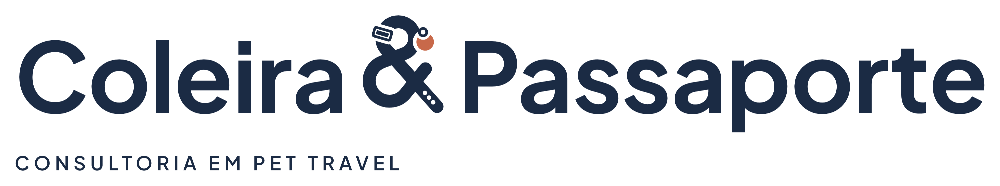

# Coleira & Passaporte · identidade visual

Direção C · Elo · revisão r2 · 30/09/2026 · consultoria em Pet Travel

A apresentação completa (evolução, construção, sistema, testes e regras) está em
[`apresentacao/coleira-passaporte-identidade.html`](apresentacao/coleira-passaporte-identidade.html),
com versões em PNG e PDF na mesma pasta.

## O símbolo: o & é uma coleira

O “&” do nome é desenhado como uma coleira de pet. Qualquer tutor reconhece os detalhes:

1. **Laço = a coleira.** Círculo de raio 17 no grid de 100.
2. **Fivela** na lateral do laço, com a tira passando por dentro.
3. **Argola e plaquinha:** a plaquinha terracota pende de uma argola presa ao laço.
4. **Nó de cima:** a diagonal passa por cima (vem da r1).
5. **Bojo:** círculo de raio 21.
6. **Nó de baixo:** o braço passa por cima. Com essa alternância, vira um nó de verdade.
7. **Ponta da tira:** a cauda do &, arredondada e com três furos.

### Evolução

- **r0 (esboço):** & monolinha com um ponto terracota.
- **r1 (nó):** traço mais grosso, entrelaçado nos cruzamentos, e Plus Jakarta Sans no nome.
- **r2 (coleira):** fivela, argola com plaquinha pendurada no laço e ponta furada. Os elementos de apoio são novos: a faixa-coleira e as plaquinhas numeradas.

As versões anteriores estão no histórico do git (commits `58f7e5a` e `d6bf88c`). As direções A, B e C (r0) estão em [`exploracao/`](exploracao).

### Três níveis de detalhe (o mesmo desenho)

| Nível | Quando usar | O que tem |
| --- | --- | --- |
| Completo (`cp-simbolo`) | a partir de 64 px e 20 mm | tudo, incluindo os respiros do nó |
| Médio (`cp-simbolo-medio`) | de 32 a 64 px, avatar e dentro do nome | fivela, argola, plaquinha e furos, sem os respiros do nó |
| Reduzido (`cp-simbolo-reduzido`) | até 32 px, favicon e bordado até 25 mm | laço, argola e plaquinha |

## Arquivos (`final/`)

| Peça | Arquivo base | Uso |
| --- | --- | --- |
| Logo principal | `cp-logo-principal` | Nome com o & coleira em destaque + descritor. Uso preferencial (a partir de 300 px) |
| Horizontal com selo | `cp-logo-horizontal-selo` | Símbolo + nome completo: site, cabeçalhos, documentos |
| Assinatura | `cp-logo-assinatura` | Nome em uma linha, sem descritor |
| Assinatura reduzida | `cp-logo-assinatura-reduzida` | Nome com o & reduzido, para menos de 300 px |
| Vertical | `cp-logo-vertical` | Selo sobre o nome |
| Empilhada | `cp-logo-empilhado` | Coleira / & / Passaporte |
| Símbolo completo | `cp-simbolo` | Grandes formatos, fachada, embalagem, carimbo seco |
| Símbolo médio | `cp-simbolo-medio` | 32 a 64 px |
| Símbolo reduzido | `cp-simbolo-reduzido` | Até 32 px e bordado pequeno |
| Selo | `cp-selo` | & no círculo; é a assinatura reduzida |

Cada peça vem em seis versões (`_cor`, `_negativo`, `_preto`, `_branco`, `_cinza` e `_uma-cor`) e em três formatos:

- `svg/`: vetor, com o nome em curvas e fundo transparente.
- `pdf/`: vetor para gráfica, sem imagem embutida.
- `png/`: fundo transparente, de 1000 a 3000 px.

Além disso:

- `elementos/`: faixa-coleira (curta e longa) e plaquinha, em cor, negativo, preto e branco.
- `avatar/`: quadrados com fundo (azul e linho), com o símbolo médio, em SVG e em PNG de 1080 e 640 px.
- `favicon/`: `favicon.svg`, `favicon.ico` e PNG de 16, 32, 48, 180, 192 e 512 px, feitos com a versão reduzida.

## Paleta

| Cor | HEX | RGB | CMYK* | Papel |
| --- | --- | --- | --- | --- |
| Azul Passaporte | `#1B2B44` | 27, 43, 68 | 60 / 37 / 0 / 73 | Cor institucional: confiança, documentação, experiência internacional |
| Terracota Tag | `#C8694A` | 200, 105, 74 | 0 / 48 / 63 / 22 | Só na tag do &: calor, cuidado. Usar com parcimônia |
| Linho | `#F4EFE6` | 244, 239, 230 | 0 / 2 / 6 / 4 | Fundo principal; evita o branco clínico |
| Céu de Cabine | `#A9BCCB` | 169, 188, 203 | 17 / 7 / 0 / 20 | Apoio: tranquilidade e mobilidade |
| Tinta | `#111A2B` | 17, 26, 43 | 60 / 40 / 0 / 83 | Texto corrido e versão escura profunda |

\* O CMYK vem de uma conversão matemática, sem perfil ICC. Confirme com prova de impressão no perfil da gráfica (ex.: ISO Coated v2 / FOGRA39) e escolha o Pantone no guia físico.

Contrastes:

- Azul sobre Linho: 12,4:1.
- Terracota sobre Linho: 3,3:1.
- Terracota sobre Azul: 3,8:1. Use só em elementos gráficos e títulos grandes, nunca em texto pequeno.

## Tipografia

- **Plus Jakarta Sans** (Google Fonts, SIL OFL): nome, títulos e texto.
  - Bold 700 no nome.
  - SemiBold 600 nos títulos e no descritor (caixa alta, +220 de espaçamento).
  - Regular 400 no texto.
- **IBM Plex Mono** (Google Fonts, SIL OFL): dados como datas, códigos de voo, referências e checklists.

No logo, o nome já está em curvas e o “&” é o desenho próprio da marca, não o da fonte. Não redigite o logo.

## Regras básicas

- Área de proteção: x = altura da letra “C” do nome, em todos os lados.
- Tamanho mínimo:

  | Peça | Tela | Impressão |
  | --- | --- | --- |
  | Logo principal / horizontal com selo | 300 px | 60 mm |
  | Assinatura reduzida | 110 px | 30 mm |
  | Vertical / empilhada | 160 px | 40 mm |
  | Símbolo completo / selo | 64 px | 20 mm |
  | Símbolo médio | 32 px | 10 mm |
  | Símbolo reduzido | 16 px | 5 mm (bordado até 25 mm) |

- Escolha o nível de detalhe pelo tamanho. Não use o símbolo completo abaixo de 64 px.
- A terracota fica na plaquinha e nas plaquinhas de apoio. Não troque a plaquinha por patinha, osso ou coração: a coleira já diz “pet”.
- Com o nome ao lado, use o **selo**. O & livre colado ao nome seria lido como “& Coleira & Passaporte”.
- Nunca escreva “Coleira e Passaporte”, “Coleira + Passaporte” ou outra variação, nem monte o logo com o & da fonte.
- Não distorça, não gire, não troque cores e não aplique sombra, degradê, contorno ou 3D.
- Sobre fotografia, use a versão negativa numa área escura e calma. Se a foto for clara ou movimentada, use uma faixa sólida de Azul Passaporte.

## Processo e status

- **Estudos no Higgsfield (r0):** três estudos com Nano Banana 2, no projeto “Coleira & Passaporte — Identidade Visual”. A rede do ambiente bloqueou o servidor de imagens, então não consegui vê-los. Na r1 e na r2 não houve geração por IA: os créditos estavam zerados, e a evolução foi desenhada direto em vetor.
- **Vetores:** construídos geometricamente em código, sem rastreamento de imagem de IA (ver [`fonte-vetorial/`](fonte-vetorial)). O nome está em curvas a partir da fonte, com a grafia exata “Coleira & Passaporte”.
- **Revisão recomendada antes do registro:** ajuste fino de espaçamento entre letras, fivela e furos para bordado e gravação, e prova de cor impressa.

## Antes de usar comercialmente

Esta proposta **não declara a marca juridicamente disponível**. Ainda é preciso verificar:

- **INPI:** busca de anterioridade da marca nominativa e mista. A classe 39 é um ponto de partida; confirme as demais com um especialista.
- **Domínio:** o “&” não é aceito em endereços, então será preciso uma grafia técnica, sem mudar o nome da marca.
- **Redes sociais:** disponibilidade dos perfis.

Os contatos e @ dos mockups são fictícios. A foto do teste “sobre fotografia” é “Chelsea the cat”, de Stefan van der Walt, CC0 (banco de imagens do scikit-image).
