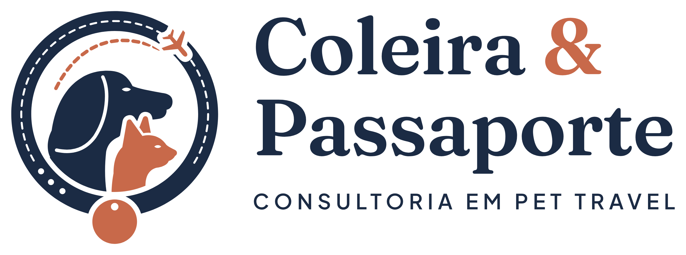

# Coleira & Passaporte · identidade visual

Direção E · Companheiros de viagem, rodada 2 · 01/10/2026 · consultoria em Pet Travel

A apresentação completa (conceito, construção, sistema, testes e regras) está em
[`apresentacao/coleira-passaporte-identidade.html`](apresentacao/coleira-passaporte-identidade.html),
com versões em PNG e PDF na mesma pasta.

## O conceito: o nome, desenhado

- **Coleira:** é a moldura do emblema, com alça costurada e três furos de regulagem.
- **Passaporte:** é a plaquinha de identificação, presa na borda de baixo da coleira, com o furo de identificação. É o documento do pet: microchip, vacinas, certificados.
- **Companheiros:** um cão e um gato juntos, olhando para a frente, para onde vão. A marca atende as duas espécies.
- **Viagem:** uma rota de voo tracejada cruza o céu da coleira, e o avião atravessa a alça: a viagem sai da moldura.

**Selo:** o nome vai escrito na própria alça, como numa coleira personalizada: “Coleira & Passaporte” no alto e “Consultoria em Pet Travel” embaixo.

**Tom:** o que separa a marca de um pet shop é a paleta sóbria, a serifada editorial e o desenho plano.

### O que melhorou na rodada 2

- **Quase redondo:** a plaquinha subiu para a borda da coleira, então o emblema cabe num círculo (avatar, adesivo, bordado).
- **A viagem sai da moldura:** o avião agora cruza a alça, recortado do couro.
- **Pets maiores:** no mesmo tamanho de emblema, cão e gato ficam 13% maiores.
- **Logo compacto:** nova assinatura com o nome em duas linhas, “Coleira &” / “Passaporte”, 36% mais estreita que o horizontal na mesma altura.

### Na disputa com Imigrapet e Tripulapet

Na pesquisa de nomes, os três saíram verdes. A apresentação compara os três no mesmo teste (avatar e lista de conversas), com os símbolos de Imigrapet e Tripulapet como estão nas pranchas de cada um.

- **Força:** a Coleira & Passaporte é a única que mostra cão e gato e conta o serviço inteiro. É também uma frase, longe dos compostos “pet + viagem” que deram conflito (Pet Travel, Passapet, PetPass, Viagem Pet) ou pedem atenção (Vet Travel, PetPorte).
- **Ponto fraco:** o nome é o mais longo, com 20 caracteres. O logo compacto resolve o espaço. Para @ e domínio, será preciso uma grafia sem o “&”.

## Arquivos (`final/`)

| Peça | Arquivo base | Uso |
| --- | --- | --- |
| Selo | `cp-selo` | O nome escrito na coleira. Assinatura principal: redes, adesivo, embalagem, carimbo, bordado |
| Horizontal | `cp-logo-horizontal` | Emblema + nome + descritor: site, documentos, apresentações |
| Compacto | `cp-logo-compacto` | Emblema + nome em duas linhas + descritor: cabeçalho de redes, cartão, espaços quadrados |
| Assinatura | `cp-logo-assinatura` | Emblema simplificado + nome, sem descritor: menu, rodapé, e-mail |
| Vertical | `cp-logo-vertical` | Emblema sobre o nome |
| Nome | `cp-logo-nome` | Só o logotipo, quando o emblema já está na peça |
| Emblema | `cp-emblema` | Coleira, pets e rota, sem o nome (a partir de 64 px) |
| Emblema simplificado | `cp-emblema-simplificado` | Sem costura, furos, rota e olhos (32 a 96 px) |
| Ícone | `cp-icone` | Os dois pets num disco (até 32 px e favicon) |

Cada peça vem em seis versões (`_cor`, `_negativo`, `_preto`, `_branco`, `_cinza`, `_uma-cor`) e em três formatos:

- `svg/`: vetor, com o nome em curvas e fundo transparente.
- `pdf/`: vetor para gráfica, sem imagem embutida.
- `png/`: fundo transparente, de 1000 a 3000 px.

Nas versões de uma cor, o nome do selo fica vazado na alça, e o cão do ícone é recortado do disco.

Pastas complementares:

- `elementos/`: a rota de voo e a plaquinha, para compor peças.
- `avatar/`: quadrados com fundo, em azul e em linho, em SVG e em PNG de 1080 e 640 px. A coleira inteira fica dentro do recorte circular, com a plaquinha como aba.
- `favicon/`: `favicon.svg`, `favicon.ico` e PNG de 16, 32, 48, 180, 192 e 512 px.

## Paleta

| Cor | HEX | RGB | CMYK* | Papel |
| --- | --- | --- | --- | --- |
| Azul Passaporte | `#1B2B44` | 27, 43, 68 | 60 / 37 / 0 / 73 | Cor institucional: a coleira, o cão e o nome |
| Terracota | `#C8694A` | 200, 105, 74 | 0 / 48 / 63 / 22 | O gato, a plaquinha, a rota e o “&” |
| Linho | `#F4EFE6` | 244, 239, 230 | 0 / 2 / 6 / 4 | Fundo principal e o nome escrito no selo |
| Céu de Cabine | `#A9BCCB` | 169, 188, 203 | 17 / 7 / 0 / 20 | Apoio: tranquilidade e mobilidade |
| Tinta | `#111A2B` | 17, 26, 43 | 60 / 40 / 0 / 83 | Texto corrido e fundo escuro profundo |

\* O CMYK vem de conversão matemática, sem perfil ICC. Confirme com prova de impressão no perfil da gráfica (ex.: ISO Coated v2 / FOGRA39) e escolha o Pantone no guia físico.

## Tipografia

- **Fraunces SemiBold** (Google Fonts, SIL OFL): nome e títulos. É uma serifada de desenho suave, que dá o tom de consultoria cuidadosa e equilibra a ilustração dos pets. No logo e no selo, o “&” fica em terracota.
- **Plus Jakarta Sans** (Google Fonts, SIL OFL): texto corrido, botões e descritor. No descritor, SemiBold 600 em caixa alta, com +220 de espaçamento.
- **IBM Plex Mono** (Google Fonts, SIL OFL): datas, códigos de voo e referências.

No logo e no selo, o nome já está em curvas. Não redigite o logo com a fonte.

## Regras básicas

- **Área de proteção:** x = altura da letra “C” do nome, em todos os lados. No selo, x = largura da alça.
- **Qual peça usar:**
  - Selo: redes, adesivos, embalagens e carimbo.
  - Horizontal: site, documentos e apresentações.
  - Compacto: cabeçalho de redes e cartão.
  - Assinatura: menu, rodapé e e-mail.
- **Nível de detalhe:** abaixo de 64 px, use o emblema simplificado; abaixo de 32 px, o ícone.
- **Tamanho mínimo:**

  | Peça | Tela | Impressão |
  | --- | --- | --- |
  | Selo | 140 px | 30 mm |
  | Horizontal | 180 px | 45 mm |
  | Compacto | 130 px | 32 mm |
  | Assinatura | 120 px | 30 mm |
  | Vertical | 100 px | 25 mm |
  | Emblema | 64 px | 15 mm |
  | Emblema simplificado | 32 px | 8 mm (bordado: 12 mm) |
  | Ícone | 16 px | 5 mm |

- **Terracota:** fica no gato, na plaquinha, na rota e no “&”. Não é cor de texto corrido.
- **Rota tracejada:** use como elemento de apoio para ligar informações, como origem e destino.
- **Nome:** nunca escreva “Coleira e Passaporte”, “Coleira + Passaporte” ou outra variação, nem reescreva o texto do selo.
- **Enfeites:** não acrescente patinha, osso ou coração ao emblema.
- **Efeitos:** não distorça, não gire, não troque cores e não aplique sombra, degradê, contorno ou 3D.
- **Sobre fotografia:**
  - Em foto movimentada, ponha o logo em versão negativa numa faixa sólida de Azul Passaporte.
  - Numa área escura e calma da foto, a versão negativa pode ir direto, com o “&” em linho.

## Pontos de atenção

- **Vocabulário comum:** cão + gato é comum no setor pet. O que diferencia a marca é a coleira, a plaquinha e a rota; mantenha os três juntos.
- **Avião:** o briefing pedia para evitar o avião clichê. Aqui ele é pequeno, cortado na alça, e não aparece nas versões reduzidas. Se preferir, a rota pode terminar sem o avião (`plane_mode=None` em `fonte-vetorial/emb2.py`).

## Processo e status

- **Versões anteriores:** Elo (r0 a r2), Dobra e a rodada 1 desta direção estão na pasta [`../work/`](../work), com todas as variações, e no histórico do git. O código de todas elas está em [`fonte-vetorial/`](fonte-vetorial) e regera cada uma em `historico/`, sem tocar em `final/`.
- **Estudos:**
  - As direções A, B e C (r0) estão em [`exploracao/`](exploracao).
  - Os estudos Janela e Retrato estão em [`exploracao/rodada-3/`](exploracao/rodada-3).
- **Sem IA nesta rodada:** tudo foi desenhado direto em vetor, porque os créditos do Higgsfield estavam zerados.
- **Vetores:** construídos em código, sem rastreamento de imagem de IA.
  - Os pets são curvas desenhadas à mão no código.
  - O nome está em curvas a partir da fonte, com a grafia exata “Coleira & Passaporte”, inclusive no arco do selo.
- **Revisão recomendada antes do registro:** desenho fino dos pets, espaçamento do nome e prova de cor impressa.

## Antes de usar comercialmente

Esta proposta **não declara a marca juridicamente disponível**. Ainda é preciso verificar:

- **INPI:** busca de anterioridade da marca nominativa e mista. A classe 39 é um ponto de partida; confirme as demais com um especialista.
- **Domínio:** o “&” não é aceito em endereços, então será preciso uma grafia técnica, sem mudar o nome da marca.
- **Redes sociais:** disponibilidade dos perfis.

Os contatos e @ dos mockups são fictícios. A foto do teste “sobre fotografia” é “Chelsea the cat”, de Stefan van der Walt, CC0 (banco de imagens do scikit-image).
