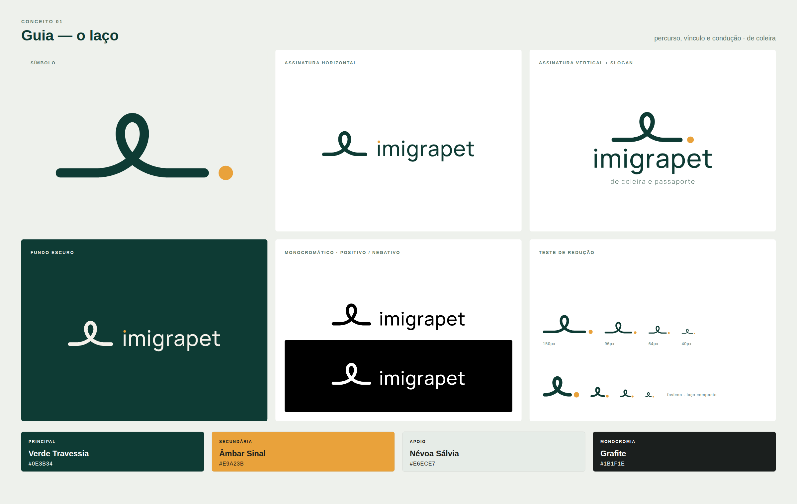
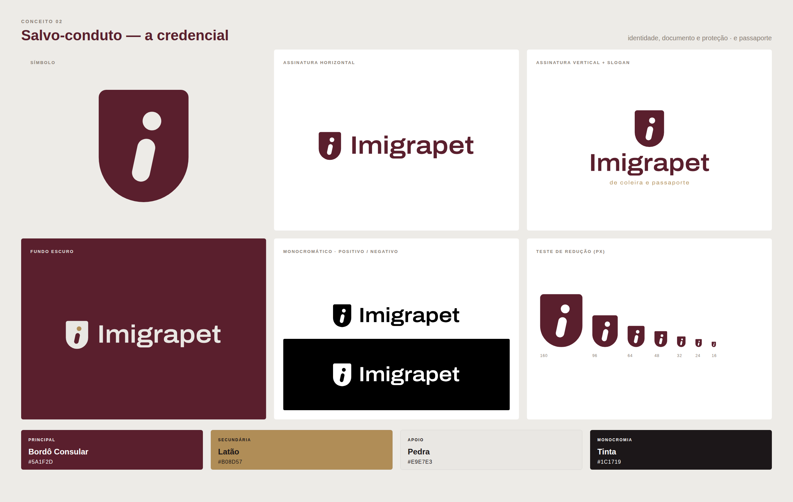

# Imigrapet — dois caminhos novos de identidade

**Cliente:** Imigrapet, transporte, documentação e relocation internacional de animais de estimação
**Slogan aprovado:** *de coleira e passaporte*
**Entrega:** dois conceitos de logo independentes das propostas anteriores, com estratégia, paleta, tipografia, gerações no Higgsfield, controle de qualidade, recomendação e guia de vetorização.

```
imigrapet/
├── README.md                     ← este documento
├── apresentacao.html             ← apresentação completa para a cliente (abrir no navegador)
├── rodada-3/                     ← três ideias novas: Mudança, Focinho e Chegada (ver rodada-3/README.md)
├── rodada-4/                     ← revisão com o retorno: Pata (azul), Passaporte com orelhas e Coleira em órbita
├── rodada-5/                     ← Pata aprimorada + sistema; conceitos novos Dupla e Chave
├── higgsfield/prompts.md         ← prompts finais, IDs dos jobs e links das imagens geradas
├── pranchas/                     ← pranchas de apresentação e de construção (PNG, renderizadas do vetor)
│   ├── prancha-guia.png
│   ├── prancha-salvo-conduto.png
│   ├── construcao-guia.png
│   └── construcao-salvo-conduto.png
└── vetor/                        ← SVGs-base para a vetorização final (texto já convertido em curvas)
    ├── 01-guia/
    └── 02-salvo-conduto/
```

---

## 1. Por que as propostas anteriores não fecharam

| Proposta | O que funcionava | Por que não é o logo definitivo |
|---|---|---|
| **Andorinha** | Metáfora de migração e retorno. | Fala de *migração humana*, não do animal. É o pássaro errado para uma marca de cães e gatos, é um dos símbolos mais saturados do repertório português (tatuagem, Bordallo Pinheiro, agências de viagem) e não carrega documento, cuidado nem especialidade. |
| **Gato e cachorro na janela do avião** | Emoção, presença do animal, sensação de "vamos juntos". Foi o que a cliente gostou. | É uma **cena**, não uma marca. Tem quatro elementos (dois animais, janela, avião), não sobrevive a 16 px, prende a empresa ao modal aéreo (o serviço é o *processo*, não o voo) e empurra a leitura para companhia aérea ou pet shop. |
| **Ícones ilustrativos** | Acessíveis e simpáticos. | Parecem botão de aplicativo ou ícone de banco de imagens. Não têm lógica construtiva própria, e sem lógica não há sistema. |
| **Kit "Coleira & Passaporte"** (rodada anterior deste repositório, branch `claude/intelligent-feynman-wazrx8`): Tag de Embarque, Rota da Coleira e **Elo** (o "&" em traço contínuo), com azul-marinho, linho e terracota | O Elo tinha construção própria e um traço único do começo ao fim. | O "&" era a conjunção do nome usado naquela rodada. Com a marca **Imigrapet**, ele perde a razão de existir. A Tag de Embarque era genérica, a Rota podia ser lida como cinto ou cobra, e a paleta é justamente a que a cliente quer deixar para trás. |

**O aprendizado:** a cliente responde à *emoção* e à *presença do animal*, mas a marca precisa de **redução**. A saída não é desenhar o pet melhor. É desenhar **aquilo que o pet carrega**: a coleira, a guia, a plaqueta, o documento. O animal aparece por metonímia, pelos objetos dele, e não por ilustração.

## 2. A oportunidade estratégica

O diferencial da Imigrapet não é o veículo, é a **condução do processo**. E o slogan aprovado já traz a divisão exata do território:

- **"de coleira"**: vínculo, condução, cuidado no percurso → **Conceito 1: Guia**
- **"e passaporte"**: identidade, documento, proteção → **Conceito 2: Salvo-conduto**

Cada conceito encarna metade da frase. As duas metades têm silhuetas, lógicas e sensações opostas: uma é **linha aberta e contínua**, a outra é **forma sólida e fechada**.

---

## 3. Conceito 1 — GUIA (o laço)



### 3.1 Ideia estratégica
Em português, **guia** é ao mesmo tempo:
1. a **correia** que liga o tutor ao animal;
2. **quem conduz** por um caminho desconhecido;
3. um **documento de trânsito** (como a GTA, Guia de Trânsito Animal).

É exatamente o que a Imigrapet faz: é a linha que não se solta entre a origem e o destino.

### 3.2 O símbolo
Uma **única linha contínua**, de espessura constante e terminais redondos. Ela corre na horizontal (origem), sobe e forma **um laço que cruza sobre si mesmo**, desce, segue na horizontal (chegada) e termina em um **ponto âmbar** separado (o destino).

Leituras, na ordem em que aparecem:
- **Percurso:** uma rota com um único momento de volta sobre si. É o cuidado no meio da viagem.
- **Vínculo:** o *laço*, em sentido afetivo ("laços") e físico.
- **Coleira e guia:** o laço é a alça da guia, onde a mão segura.
- **Identificação e destino:** o ponto é a plaqueta, a chegada e o pingo do "i".
- **Leitura secundária, só depois de explicada:** um rabo enrolado de cão feliz na chegada.

### 3.3 Justificativa da construção
- O laço **não é desenhado à mão livre**. É uma **cicloide prolata** (x = r(t − k·sen t), y = −r·k·cos t, com r = 20u, k = 2,4 e t ∈ [−π, π]), a curva que um ponto descreve fora de uma roda que rola. Isso garante tangência perfeita entre as retas e o laço, sem nenhum "ombro" na junção, e dá ao gesto um ritmo mecânico e confiável, nada caligráfico.
- Traço de 16u (0,8 r); ponto âmbar com Ø 25u (1,56× o traço); folga de 16,8u entre a linha e o ponto.
- A base do traço alinha com a **linha de base do wordmark**: a rota "leva" ao nome.
- **Regra de assinatura:** na horizontal, o ponto âmbar sai do fim da linha e **vira o pingo do primeiro "i"**. O destino passa a ser a própria marca. Isso também evita a leitura "ℓ. imigrapet", em que o ponto parece pontuação.
- **Versão compacta** (favicon/avatar): caudas curtas, traço 18u (mais pesado, para sobreviver a 16 px).

### 3.4 Paleta
| Papel | Nome | HEX | Justificativa |
|---|---|---|---|
| Principal | **Verde Travessia** | `#0E3B34` | É o sinal verde, a passagem liberada: nas alfândegas, o canal verde é o "nada a declarar". Verde profundo transmite vida e cuidado sem cair no verde-menta de clínica, e sua densidade dá seriedade e sofisticação. Fica longe do azul-marinho anterior. |
| Secundária | **Âmbar Sinal** | `#E9A23B` | A luz da sinalização de aeroportos e estradas: orientação, calor, reencontro. Use só como **acento** (o ponto, destaques). |
| Apoio | **Névoa Sálvia** | `#E6ECE7` | Fundo frio e calmo, como papel de documento. Substitui o marfim anterior por um neutro esverdeado. |
| Monocromia | **Grafite** | `#1B1F1E` | Texto corrido e aplicações a uma cor. |

**Acessibilidade (WCAG):** verde sobre branco 12,4:1 ✔ · âmbar sobre verde 5,7:1 ✔ · **âmbar sobre branco 2,2:1 ✘**. O âmbar nunca pode ser cor de texto sobre fundo claro. Referências Pantone e CMYK devem ser validadas em prova de impressão; não as fixei sem prova física.

### 3.5 Direção tipográfica
- **Base:** Manrope Medium (Google Fonts, licença OFL, uso comercial livre), uma sans geométrica-humanista.
- **Wordmark:** `imigrapet` em **caixa-baixa**, tracking +18/1000. A caixa-baixa conversa com a informalidade acolhedora da linha.
- **Ajustes já aplicados nos SVGs:** os pingos quadrados da fonte foram trocados por **pingos redondos 32% maiores que a haste**, que ecoam o ponto do símbolo. O primeiro pingo é âmbar na assinatura horizontal. O `g` de um andar e o `t` de pé curvo, nativos da Manrope, repetem a curva do laço.
- **Slogan:** Manrope Light, tracking +110, com 25% do corpo do nome, em verde-acinzentado `#5E7A70` (4,7:1 sobre branco). Aparece só na assinatura vertical completa.
- **Refinos manuais pendentes:** kerning de `ra`, `pe` e `et`, compensação óptica dos pingos no corpo pequeno e leve redução do terminal do `t`.

### 3.6 Prompt final no Higgsfield
O prompt completo, com ID do job e link, está em [`higgsfield/prompts.md`](higgsfield/prompts.md#conceito-1--guia--v2-aprovada). A v2 usa **a minha construção vetorial do laço como imagem de referência**, porque a v1 só com texto falhou (ver 3.7).

### 3.7 Crítica profissional do resultado
- **Higgsfield v1 (só texto): descartada.** O modelo desenhou um **anel apoiado sobre a linha**, sem o cruzamento. O conjunto virou um "Q.", e o OCR leu literalmente `Q.imigrapet`. É um símbolo genérico e confuso. Rejeitada conforme o critério do briefing.
- **Higgsfield v2 (com referência vetorial): aprovada com ressalvas.** O laço cruzado foi respeitado, e o texto está correto em todos os painéis (OCR: `imigrapet` ×4 e `de coleira e passaporte` ×1, sem erros). O modelo propôs algo bom: na assinatura horizontal, a linha continua **por baixo do nome até o ponto âmbar**. Vale guardar como variação "assinatura de percurso" para capas e cabeçalhos. **Ressalva:** o OCR ainda leu o laço pequeno colado ao nome como "Q", o que confirma a necessidade da regra do ponto migrando para o "i" e de respiro entre símbolo e palavra. A resolução é 1k, porque os créditos acabaram (ver `higgsfield/prompts.md`).
- **Checklist:**

| Verificação | Resultado |
|---|---|
| Parece a andorinha? | Não. Não há figura de pássaro. |
| Depende de avião ou janela? | Não. |
| Virou ícone de pet? | Não. |
| Infantil? | Não. O traço é contínuo e sóbrio, e a cor é profunda. |
| Clínica veterinária? | Não. Não há cruz, verde-menta nem branco hospitalar. |
| Companhia aérea? | Não. A trajetória sugere voo sem desenhar asa ou avião. |
| "Imigrapet" correto? | Sim. O wordmark usa `imigrapet` em caixa-baixa por decisão de desenho. |
| "de coleira e passaporte" correto? | Sim. |
| Funciona em preto e branco? | Sim (ver prancha). |
| Funciona sem slogan? | Sim. O slogan só entra na vertical. |
| Legível em tamanho pequeno? | **Parcialmente.** O símbolo completo é largo (≈2,6:1); abaixo de ~60 px use a versão compacta. |
| Reconhecível sem o nome? | Sim, depois de algumas exposições. A silhueta de "linha com laço e ponto" é única no segmento. |
| É proprietário? | Provavelmente sim: não conheço marca do segmento com esta construção. Mas **não fiz busca de anterioridade**, então a busca formal no INPI nas classes pertinentes (ex.: 39, transporte; 45, serviços de documentação) é obrigatória antes de aprovar. |
| Algum clichê? | O laço *pode* lembrar a fita de conscientização ou um "ℓ" cursivo. A mitigação é manter as caudas horizontais e longas (a fita tem caudas diagonais) e nunca exibir o laço sem as caudas. |
| **Parecido com modelos anteriores?** | **Sim, em parte.** A silhueta é outra, mas ele repete a assinatura formal do **Elo** (&) da rodada anterior: traço contínuo, laço com cruzamento e ponto quente na ponta. Ver seção 5. |

### 3.8 Pontos fortes
- É a opção de **maior diferenciação**: as marcas do segmento que conheço usam pata, avião, globo ou mascote, não uma linha contínua como assinatura. Ainda falta confirmar com a busca de anterioridade.
- Tem **emoção sem ilustração**. Recupera o afeto que a cliente viu na janela, só que por gesto.
- **Vira sistema com facilidade.** A linha pode se estender como divisor de layout, sublinhado de títulos, rota em infográficos do processo (documentação → vacinas → embarque → chegada) e animação (a linha se desenhando), e o ponto âmbar vira marcador de etapa.
- A história é fácil de contar: *guia* tem três sentidos.

### 3.9 Riscos e limitações
- A proporção horizontal pede **duas versões** (completa e compacta) e regras de uso.
- O risco de leitura como "ℓ" ou fita de conscientização aparece se as proporções forem alteradas.
- O âmbar não serve para texto sobre claro.
- A linha fina reproduz mal em bordado pequeno. No uniforme, use a versão compacta com pelo menos 25 mm.

---

## 4. Conceito 2 — SALVO-CONDUTO (a credencial)



### 4.1 Ideia estratégica
*Salvo-conduto* é o documento que garante **passagem segura** por um território. Junta identidade, documento e proteção numa palavra só. A Imigrapet é, para a família, o salvo-conduto do animal: a garantia de que ele atravessa a burocracia internacional protegido.

### 4.2 O símbolo
Uma **forma compacta e sólida** que é, ao mesmo tempo, **escudo contemporâneo** e **plaqueta de identificação**: topo reto com cantos pouco arredondados, laterais retas e base em semicírculo perfeito. Dentro, o espaço negativo recorta um **"i" minúsculo inclinado 12°**:
- o **pingo** é o **furo da plaqueta**, por onde passa a argola da coleira;
- a **haste** é uma **cápsula**, a forma exata do **microchip**, que é a verdadeira identidade internacional do animal e o primeiro passo de qualquer processo de viagem;
- a **inclinação de 12°** é o **movimento**: a identidade em trânsito.

O animal está presente pelos objetos que só ele usa (plaqueta e microchip), sem nenhum desenho de animal.

### 4.3 Justificativa da construção
- Silhueta de 120 × 150u (4:5): cantos superiores r = 10u; base em semicírculo de Ø 120u com centro em y = 90u. É **deliberadamente diferente** do quadrado arredondado de app (cantos superiores mais secos e base circular).
- "i" alinhado a um eixo a 12° que passa por (60u, 94u); haste em cápsula de 24 × 58u; folga de 12u; pingo de Ø 25u, levemente maior que a haste, para ler como *furo* e não só como pingo.
- Só três elementos: silhueta, furo e cápsula. Funciona inteiro a 16 px.

### 4.4 Paleta
| Papel | Nome | HEX | Justificativa |
|---|---|---|---|
| Principal | **Bordô Consular** | `#5A1F2D` | A cor de muitos passaportes do mundo (União Europeia e outros), citada sem desenhar passaporte. Institucional, premium e quente, o que dá acolhimento. Nada tem a ver com o terracota anterior (laranja terroso) nem com o azul-marinho. |
| Secundária | **Latão** | `#B08D57` | O metal das plaquetas e das ferragens de coleira, e o "dourado" do passaporte em versão fosca e contemporânea. Serve para acentos e hot stamping em papelaria. |
| Apoio | **Pedra** | `#E9E7E3` | Neutro quente-acinzentado, como papel de documento de alta gramatura, sem ser marfim. |
| Monocromia | **Tinta** | `#1C1719` | Texto e aplicações a uma cor. |

**Acessibilidade (WCAG):** bordô sobre branco 12,6:1 ✔ · pedra sobre bordô 10,2:1 ✔ · **latão sobre branco 3,1:1 e sobre bordô 4,1:1 ✘ para texto pequeno**. Para o slogan em corpo pequeno, use **Latão Texto `#7E6135`** (5,8:1 sobre branco) e, sobre bordô, **Latão Claro `#D2B27A`** (6,2:1). O `#B08D57` fica para acentos, grafismos e títulos grandes.

### 4.5 Direção tipográfica
- **Base:** Archivo SemiExpanded SemiBold (Google Fonts, OFL), uma grotesca contemporânea levemente larga, com presença institucional de documento.
- **Wordmark:** `Imigrapet` com "I" maiúsculo, tracking −4/1000, terminais retos. O "I" maiúsculo em haste única conversa com a haste do símbolo.
- **Slogan:** Archivo Regular, tracking +140, com 22% do corpo do nome, em latão (ver a nota de acessibilidade acima).
- **Refinos manuais pendentes:** arredondar 1–2u os cantos dos pingos quadrados, para conversar com o furo; ajustar o kerning `Im` e `ra`; e testar um corte de 12° no terminal superior do `t`, ecoando a inclinação do "i", **só se** não prejudicar a leitura.
- A família Archivo tem eixo de largura: use a versão condensada em tabelas e documentos operacionais (checklists de países, prazos).

### 4.6 Prompt final no Higgsfield
Completo em [`higgsfield/prompts.md`](higgsfield/prompts.md#conceito-2--salvo-conduto-aprovada).

### 4.7 Crítica profissional do resultado
- **Higgsfield: aprovado com ressalvas.** A silhueta escudo-plaqueta e o "i" inclinado foram reproduzidos fielmente, e o texto está correto em todos os painéis (OCR: `Imigrapet` ×4 e `de coleira e passaporte` ×2, sem erros). **Desvios:** o painel escuro saiu preto-tinta em vez de bordô; na versão monocromática, o OCR leu o símbolo como "1", sinal de que o pingo encostou demais na haste no render. Nos SVGs corrigi com folga de 12u entre pingo e haste.
- **Checklist:**

| Verificação | Resultado |
|---|---|
| Parece a andorinha? | Não. |
| Depende de avião ou janela? | Não. |
| Virou ícone de pet? | Não. |
| Infantil? | Não. É a opção mais sóbria das duas. |
| Clínica veterinária? | Não. Não há cruz, e bordô e latão não são cores de saúde. |
| Companhia aérea? | Não. |
| "Imigrapet" correto? | Sim. |
| "de coleira e passaporte" correto? | Sim. |
| Funciona em preto e branco? | Sim. É uma forma sólida com recorte, ideal para carimbo seco, gravação a laser e bordado. |
| Funciona sem slogan? | Sim. |
| Legível em tamanho pequeno? | **Sim, a melhor das duas.** Íntegro a 16 px. |
| Reconhecível sem o nome? | Sim, pela silhueta. |
| É proprietário? | **Moderadamente.** A família "i num escudo ou círculo" existe (ícone de informação, seguradoras), mas a inclinação, o furo de plaqueta e a base semicircular afastam o genérico. Mesmo assim, é o ponto fraco. |
| Algum clichê? | Proximidade com o ícone universal de "informação" (ⓘ). |
| **Parecido com modelos anteriores?** | **Não.** Há um parentesco leve com a **Tag de Embarque** (plaqueta com furo), mas a silhueta (escudo de base redonda × etiqueta de cantos cortados), a lógica (monograma × linhas de dados) e a paleta são diferentes. |

### 4.8 Pontos fortes
- **Clareza e escalabilidade máximas**: favicon, avatar, bordado, gravação em plaqueta *real* de coleira (o símbolo cabe numa medalha de verdade, um brinde de marca perfeito).
- A paleta **bordô e latão** comunica documento, instituição e premium sem esforço.
- Presença institucional forte diante de consulados, companhias e parceiros veterinários.
- O símbolo funciona como **selo** em documentos, checklists e certificados de entrega.

### 4.9 Riscos e limitações
- Genericidade relativa: "i em escudo" pode ser lido como *informação* ou *seguro*.
- Menos emoção. Resolve o "passaporte" melhor que o "coleira".
- Bordô e latão podem puxar para jurídico ou vinícola se a fotografia e o tom de voz não trouxerem calor. O sistema precisa de fotografia afetiva de animais e famílias para equilibrar.

---

## 5. Avaliação comparativa (1–5)

### Checagem de independência contra a rodada anterior
Antes de fechar, comparei os dois conceitos com o kit "Coleira & Passaporte" que já está neste repositório:

| Novo conceito | Parente mais próximo na rodada anterior | O que se repete | O que muda | Veredito |
|---|---|---|---|---|
| **Guia** | **Elo** (o "&" em traço contínuo, com a tag terracota) | Traço monolinha de terminais redondos, **laço com cruzamento** e **ponto de cor quente na ponta** | Silhueta (rota horizontal × glifo "&"), nenhuma letra, paleta verde e âmbar | **Parentesco forte.** Quem viu o "&" tende a ler o Guia como "o mesmo traço, esticado". |
| **Salvo-conduto** | **Tag de Embarque** (etiqueta de bagagem com argola e linhas de dados) | Plaqueta com furo | Silhueta de escudo com base semicircular, monograma "i" inclinado, sem linhas de dados, paleta bordô e latão | **Independente.** Fala do mesmo universo, mas com outra forma. |

O território semântico é o mesmo por natureza: o slogan é "de coleira e passaporte" e o nome usado na rodada anterior era "Coleira & Passaporte". O briefing, porém, pede **independência visual**, e nesse critério o Guia não passa.

| Critério | Guia | Salvo-conduto |
|---|:-:|:-:|
| Diferenciação no mercado | **5** | 3 |
| Memorabilidade | 4 | 4 |
| Clareza | 3 | **5** |
| Escalabilidade | 3 | **5** |
| Sofisticação | **5** | 4 |
| Aderência ao segmento | 4 | **5** |
| Potencial de identidade completa | **5** | 4 |
| Independência das propostas anteriores | 2 | **4** |
| **Total (de 40)** | **31** | **34** |

### Direções descartadas antes do Higgsfield (exploração vetorial)
Rejeitei estas direções no meu próprio controle antes de gastar créditos:
- **Laço vertical com caudas diagonais:** virava a fita de conscientização e um bonequinho de braços abertos.
- **Fivela-portal** (linha atravessando um retângulo): lia como Φ, plugue ou fivela de cinto.
- **Berço** (ponto apoiado numa curva da linha): delicado, mas lido como sorriso ou "bola num buraco".
- **Plaqueta com orelha dobrada (dog-ear) e "i":** a ideia da orelha de documento é ótima, mas o resultado virou o ícone genérico de *arquivo* de sistema operacional.
- **Selo circular com borda dobrada:** virou ícone de adesivo ou lua crescente.
- **"i" reto no escudo:** idêntico ao ícone de informação. A inclinação de 12° foi o que salvou o conceito.

---

## 6. Recomendação: avançar com o **Conceito 2, Salvo-conduto**

**Recomendo avançar com o Salvo-conduto.** Ele soma mais pontos e, principalmente, é o único dos dois que cumpre a exigência central do briefing: ser visualmente independente de tudo que a cliente já viu.

1. **É uma forma nova para a cliente.** Nenhuma proposta anterior usou escudo de base redonda, monograma ou bordô e latão.
2. **Tem a melhor execução técnica:** íntegro a 16 px, perfeito para bordado, laser, carimbo seco e a plaqueta de coleira real como brinde.
3. **Resolve o que mais pesa no serviço:** documentação, identificação e proteção.
4. **Seu ponto fraco (a proximidade com o ícone de "informação") se combate com o sistema.** A inclinação de 12°, o furo de plaqueta e a base semicircular já afastam o genérico, e o refino deve reforçar isso: nunca usar o símbolo dentro de um círculo e sempre com as proporções 4:5.

**Sobre o Guia.** Ele é a forma mais elegante e emotiva das duas, mas repete o DNA do Elo. Minha regra, seguindo o briefing:
- **Se a cliente viu o "&" do kit anterior**, o Guia deve ser descartado, e eu desenvolvo um novo caminho de percurso e conexão sem laço nem ponto quente na ponta.
- **Se o kit anterior nunca foi apresentado a ela**, o Guia pode ser mostrado como alternativa emocional, sabendo que é um parente próximo daquela ideia.

**Próximos passos do Salvo-conduto:** (1) refino manual do wordmark (pingos e kerning `Im` e `ra`); (2) versão para bordado e laser; (3) prova de impressão do bordô e do latão, com Pantone definido no guia físico; (4) busca de anterioridade no INPI; (5) só depois, mockups (papelaria, uniforme, site, adesivo, plaqueta real). Assim que houver créditos, gere de novo a prancha no Higgsfield com o vetor como referência, corrigindo o painel escuro (bordô) e a folga do pingo (prompt sugerido em `higgsfield/prompts.md`).

---

## 7. Orientação para a vetorização manual

### Arquivos-base (`vetor/`)
- Cada conceito tem símbolo em cor, preto e negativo; assinatura horizontal (cor, preto, negativo); assinatura vertical com slogan (cor, preto); e prancha de construção. O Guia tem ainda a versão compacta para favicon.
- O **texto já está em curvas** (gerado a partir das fontes OFL), então os arquivos abrem idênticos em Illustrator, Figma ou Affinity.
- Os SVGs são **base de construção**, não arte-final. Siga os passos abaixo.

### Guia (o laço)
1. Importe `guia-construcao.svg`. A linha azul fina é a **espinha** (centro do traço) da cicloide.
2. Redesenhe a espinha com **o mínimo de nós Bézier**: 2 retas + 4 curvas (entrada, lado esquerdo do laço, lado direito do laço, saída). O SVG-base é uma polilinha densa, então **não use esses nós**.
3. Aplique o traço de 16u com terminais redondos e **expanda** (Object → Expand / Outline Stroke).
4. **Correção óptica no cruzamento:** afine o traço em ~4–6% nos 10u em volta do cruzamento, para não formar mancha. Opcionalmente, faça um *ink trap* sutil.
5. **Correção óptica no topo do laço:** engrosse ~2% no ápice, porque curvas parecem mais finas que retas.
6. O ponto âmbar é um círculo perfeito de Ø 25u. Opticamente, ele pode crescer até +3% em tamanhos abaixo de 40 px.
7. **Versão compacta:** traço de 18u, caudas de 4u e folga do ponto de 10u. Revise à mão a 16, 24 e 32 px, no pixel grid.
8. **Área de proteção:** a altura do laço (≈ 112u) em todos os lados da assinatura. **Tamanho mínimo:** símbolo completo com 90 px ou 24 mm de largura; compacto com 16 px ou 6 mm.

### Salvo-conduto (a credencial)
1. Importe `salvo-conduto-construcao.svg`. A silhueta é **geometria pura**: retângulo 120 × 90u com cantos superiores de r = 10u, unido a um semicírculo de Ø 120u.
2. Use o **Shape Builder / Pathfinder** para unir as formas e subtrair o "i". Não desenhe à mão.
3. O "i": crie a cápsula 24 × 58u e o círculo Ø 25u na vertical, alinhados, com 12u de folga. **Gire o conjunto 12°** em torno do centro da cápsula, (60u, 94u).
4. **Correção óptica:** o furo pode crescer ~3% em tamanhos pequenos para não "fechar" na impressão. Confira que a folga pingo–haste nunca fique abaixo de 10u (o render do Higgsfield falhou justamente nisso).
5. Faça versões específicas para **bordado** (base semicircular com pelo menos 8 mm de altura total, furo mínimo de 2 mm) e **gravação a laser**, com o furo vazado de verdade na plaqueta física.
6. **Área de proteção:** 2× o diâmetro do pingo. **Tamanho mínimo:** 16 px ou 6 mm de altura.

### Para os dois
- Trabalhe numa grade de 1u = 1 pt (ou 1 px) e exporte SVG, PDF/X-4 e EPS.
- Defina Pantone e CMYK **só depois de prova física** (os HEX são a fonte da verdade digital).
- Só faça mockups depois de aprovar o símbolo, conforme o briefing.

---

## 8. Transparência sobre o processo
- **Modelos usados no Higgsfield:** Nano Banana Pro (2k) nas duas primeiras pranchas e Nano Banana 2 (1k) na v2 do Guia. O `gpt_image_2_5` exige plano pago e foi recusado pela conta.
- **Créditos:** a conta tinha 5,5 créditos quando comecei. As 3 gerações de Nano Banana 2 das 14:25 UTC no extrato são os três estudos da rodada anterior (kit "Coleira & Passaporte"). Usei os 5,5 restantes em três gerações, e o saldo agora é **zero**. Por isso a v2 do Guia está em 1k e não houve rodada extra de refinamento no Higgsfield.
- **Rodada anterior:** só encontrei o kit "Coleira & Passaporte" (branch `claude/intelligent-feynman-wazrx8`) no fim do trabalho, ao preparar o commit. A checagem de independência da seção 5 e a recomendação da seção 6 já levam esse kit em conta.
- **Como avaliei as imagens geradas:** o ambiente onde trabalhei bloqueia o CDN do Higgsfield, então não consegui baixar os PNGs para este repositório. Fiz o controle de qualidade **dentro do sandbox do próprio Higgsfield**, com OCR (verificação da grafia de todos os textos) e leitura estrutural por amostragem de pixels (forma do símbolo, painéis, cores). **A avaliação estética fina (kerning, acabamento de curvas) das imagens geradas precisa ser confirmada visualmente por você** pelos links em `higgsfield/prompts.md`.
- As pranchas em `pranchas/` foram renderizadas por mim a partir dos vetores. São a referência de geometria correta, com as correções que o Higgsfield não aplicou.
