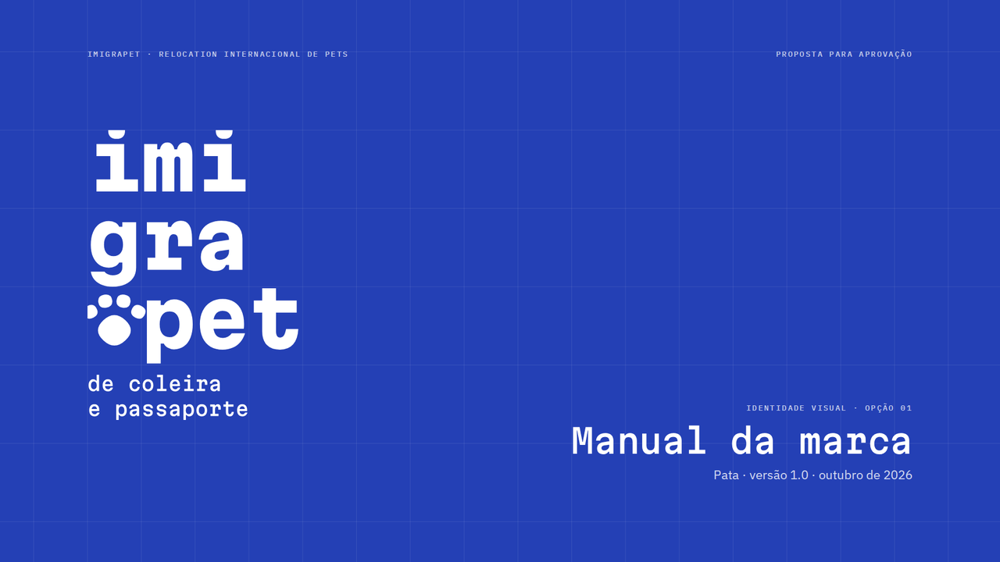
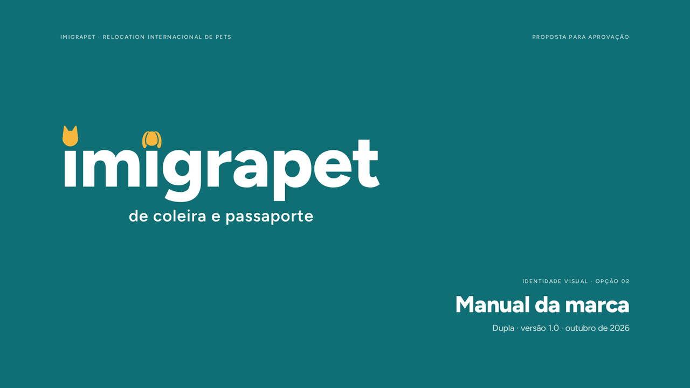
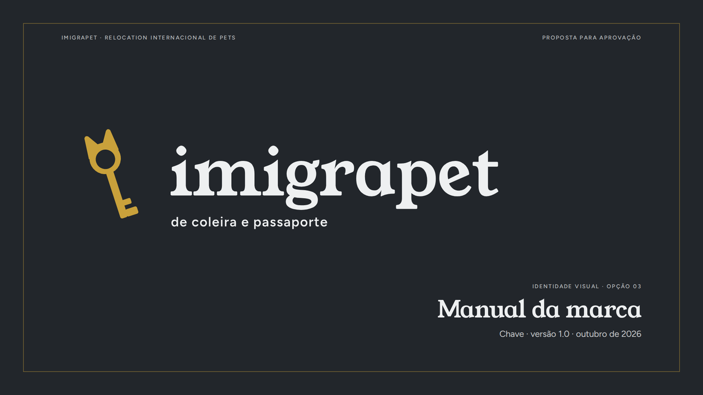

# Imigrapet · brandbooks para escolha

Três manuais de marca, um por opção, para a cliente escolher. Cada um é uma **apresentação de 12 páginas** (o limite do contrato), em PDF vetorial no formato 16:9 (1920 × 1080). O texto é selecionável e as fontes estão embutidas.

| | Opção | PDF | Prévia |
|---|---|---|---|
|  | **01 · Pata** A escolhida até aqui. Bloco 3 × 3 com a pegada, identidade azul. | [manual opção 1](opcao-1-pata/imigrapet-manual-da-marca-opcao-1-pata.pdf) | [12 páginas](opcao-1-pata/previa-12-paginas.png) |
|  | **02 · Dupla** Gato e cão nos dois "i" do nome. Verde petróleo e amarelo. | [manual opção 2](opcao-2-dupla/imigrapet-manual-da-marca-opcao-2-dupla.pdf) | [12 páginas](opcao-2-dupla/previa-12-paginas.png) |
|  | **03 · Chave** A chave da casa nova, com orelhas. Grafite e latão. | [manual opção 3](opcao-3-chave/imigrapet-manual-da-marca-opcao-3-chave.pdf) | [12 páginas](opcao-3-chave/previa-12-paginas.png) |

## As 12 páginas (iguais nos três manuais)

| # | Página | O que mostra |
|---|---|---|
| 01 | Capa | A marca na versão de capa |
| 02 | A ideia | O conceito em diagrama e três atributos |
| 03 | Símbolo | Desenho técnico da construção, com medidas |
| 04 | Assinatura principal | A marca completa e a anatomia do slogan |
| 05 | Assinaturas alternativas | Horizontal, vertical, símbolo e ícone de app, com regras de uso |
| 06 | Proteção e redução | Área de proteção (x = altura-x do nome) e tamanhos mínimos em px e mm |
| 07 | Cores | HEX, RGB, CMYK aproximado, proporção de uso e contraste WCAG |
| 08 | Versões de cor | Seis versões: principal, negativas, sobre cor e monocromáticas |
| 09 | Tipografia | Fontes da marca e hierarquia de textos |
| 10 | Elementos de apoio | Padrão gráfico e dois recursos de layout |
| 11 | Aplicações | Cartão, avatar, post, plaquinha de coleira, pasta de documentos e e-mail |
| 12 | Usos incorretos | Oito erros a evitar e onde estão os arquivos |

## O slogan, redesenhado

"de coleira e passaporte" agora tem desenho próprio em cada opção, em vez de uma linha de texto solta:

- **Pata:** Martian Mono Medium (a mesma família do nome), a ¼ do corpo, em duas linhas: *de coleira / e passaporte*. Na grade do bloco, 4 letras do slogan ocupam exatamente uma casa, e "e passaporte" mede 3 casas, a largura de "imi". O slogan passou a fazer parte do bloco.
- **Dupla:** Figtree SemiBold (a família do nome), 23% do corpo, espaçamento +30, centralizado.
- **Chave:** Figtree SemiBold, 20% do corpo, espaçamento +50, alinhado ao início do nome. O contraste com a serifa do nome cria hierarquia.

Nos três, o slogan tem um tamanho mínimo de leitura (11 px na tela, 2,5 mm impresso). Abaixo disso, usa-se a versão sem slogan.

## Arquivos da marca

Cada pasta traz `arquivos/` com os SVGs principais (texto já em curvas): principal, principal negativa, horizontal, horizontal com slogan ou vertical, símbolo e ícone de app.

## Observações

- **CMYK aproximado.** Foi calculado sem perfil de cor. Antes da primeira impressão, confirme com prova de cor e defina o Pantone com a gráfica.
- **Aplicações.** São simulações de layout planas, não fotomontagens, e todos os contatos são fictícios.
- **Fontes.** Todas têm licença livre (SIL Open Font License), com uso comercial permitido.
- **Vazados em SVG.** Na Dupla (o vazado da orelha do cão) e na Chave (o furo da argola), esses detalhes ainda estão desenhados na cor do fundo. Na vetorização final da opção escolhida, vão virar recortes reais.
