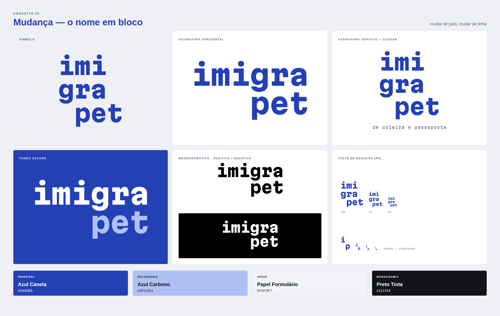
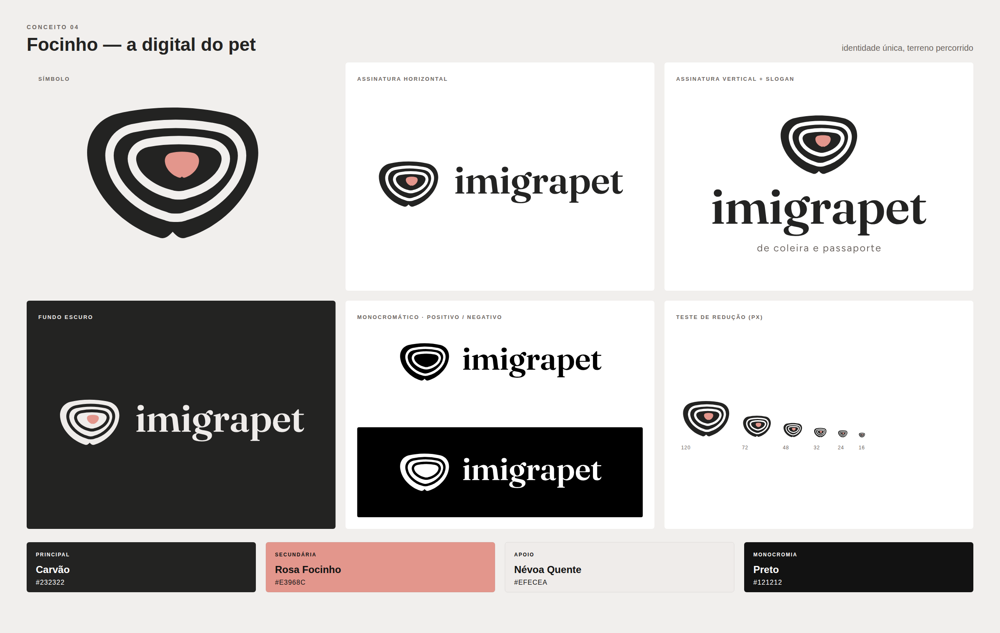
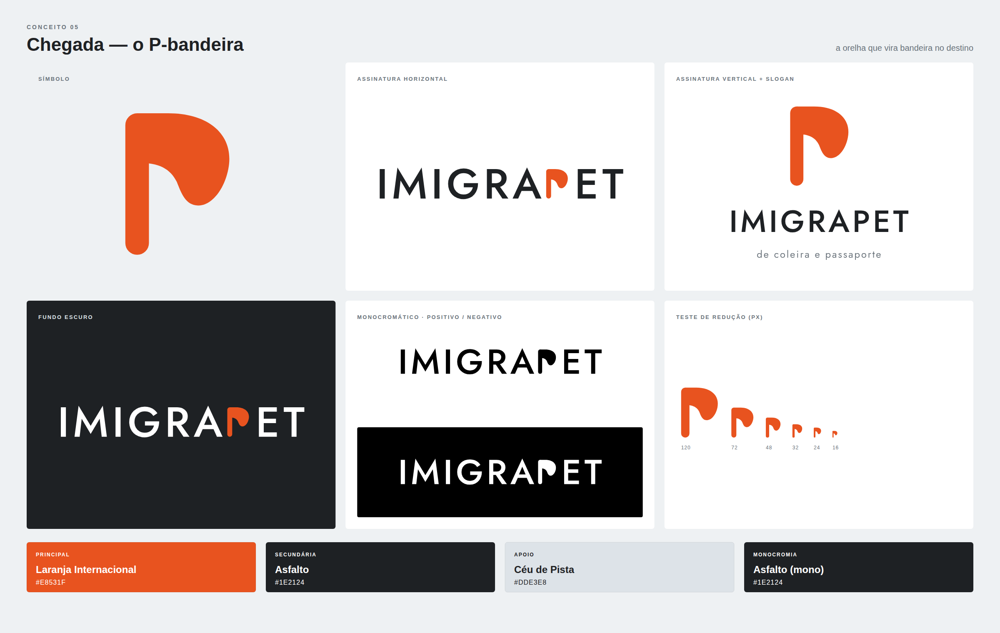

# Imigrapet · rodada 3: três ideias novas

Três conceitos novos, independentes de tudo o que já foi mostrado: andorinha, janela do avião, ícones ilustrativos, o kit "Coleira & Passaporte" (Tag de Embarque, Rota da Coleira, Elo) e os conceitos da rodada 2 (Guia e Salvo-conduto). Seguem as mesmas restrições do briefing: sem pássaro, avião, globo, pata, coração, osso, casinha, cruz veterinária, mascote nem mockup.

Apresentação completa: [`apresentacao.html`](apresentacao.html) (abrir no navegador).

Cada ideia usa uma **lógica formal diferente**:

| | Conceito | Lógica | Em uma frase |
|---|---|---|---|
| 03 | **Mudança** | Tipográfica, em grade | O próprio nome é o símbolo, e a última linha "se muda". |
| 04 | **Focinho** | Contornos orgânicos | A digital do pet: cada focinho é único, como cada processo. |
| 05 | **Chegada** | Forma sólida | Um "P" que é bandeira de chegada e orelha ao mesmo tempo. |

> **Higgsfield:** o saldo da conta está zerado desde a rodada 2, então estes três logos foram desenhados direto em vetor. No fim deste documento há um prompt sugerido para quando houver créditos.

---

## 03 · MUDANÇA (o nome em bloco)

**Ideia.** "imigrapet" tem exatamente **9 letras**, e isso vira um bloco perfeito de 3 × 3: `imi / gra / pet`. A última linha, a do *pet*, está **deslocada uma casa para a direita**. Ela se mudou. Em português, *mudança* é a troca de casa e de país, e também a troca de linha no texto. A marca é o nome fazendo exatamente o que a empresa faz: tirar o pet de um lugar e assentá-lo em outro, sem desmontar o conjunto.

**Construção.**
- O bloco é composto em Martian Mono ExtraBold (Google Fonts, licença OFL). Numa fonte monoespaçada, todas as letras ocupam a mesma célula, e a grade fica exata.
- As linhas têm entrelinha de 1,02× o corpo, e o deslocamento de "pet" é exatamente 1 célula.
- A casa vazia no canto inferior esquerdo é "o lugar de onde se partiu". Não coloquei nada nela de propósito.
- **Assinatura horizontal:** duas linhas, `imigra / pet`, com "pet" alinhado sob "gra". É a mesma ideia de deslocamento, em formato largo.
- **Versão compacta (favicon):** um "i" com um "p" deslocado embaixo. Use sempre sobre um quadrado azul.
- **Slogan:** Martian Mono Regular, tracking +40, como texto de formulário.

**Paleta.**
| Papel | Nome | HEX | Justificativa |
|---|---|---|---|
| Principal | **Azul Caneta** | `#2440B5` | O azul de caneta com que se assinam documentos (muitos formulários pedem caneta azul). Transmite confiança e autoria. É vivo, e nada tem do azul-marinho apagado da rodada anterior. |
| Secundária | **Azul Carbono** | `#AFC0F4` | O azul claro da cópia em papel carbono. Serve para destacar a linha "pet" sobre o azul. |
| Apoio | **Papel Formulário** | `#F2F3F7` | Branco frio, de papel oficial. |
| Monocromia | **Preto Tinta** | `#111318` | |

Contrastes: azul sobre branco 8,5:1 ✔; carbono sobre azul 4,7:1 ✔ (texto grande).

**Pontos fortes.**
- É o conceito **mais proprietário** até agora. Ninguém mais pode ter "imi/gra/pet", porque a marca *é* o nome.
- Não depende de clichê nenhum e se reconhece em segundos.
- É fácil de virar sistema: grades de 3 × 3 para posts e documentos, deslocamentos como recurso de layout, e tipografia monoespaçada com cara de formulário, que remete à documentação.
- Funciona em uma cor, em carimbo seco, em bordado e em gravação.

**Riscos.**
- A fonte monoespaçada pode puxar para "startup de tecnologia" se o resto do sistema não trouxer calor (fotografia afetiva).
- Abaixo de 48 px o bloco some, então a versão compacta é obrigatória.
- É azul: mesmo vivo, a cliente pode sentir que "voltou ao azul". Vale mostrar lado a lado com o azul-marinho antigo.
- A leitura em três linhas pede um segundo de atenção. É uma qualidade (a pessoa decifra e lembra), mas não é instantânea.

---

## 04 · FOCINHO (a digital do pet)

**Ideia.** O focinho de um cão é tão único quanto uma impressão digital, e há sistemas de identificação animal baseados nele. O símbolo é a **silhueta de um focinho** com **curvas internas** que lembram uma digital e, ao mesmo tempo, **curvas de nível** de um mapa topográfico: identidade e terreno percorrido. A ponta rosa é o próprio focinho, o único "calor" do símbolo.

**Construção.**
- A silhueta é uma forma larga, com topo quase reto e um pequeno entalhe na base (o sulco do focinho).
- As **duas curvas internas não têm o entalhe**. Com ele repetido, a base parecia coração. Elas são paralelas à silhueta e deslocadas levemente para cima e para a direita, como curvas de nível em volta de um cume.
- O núcleo rosa segue a forma da silhueta, com 20% do tamanho.
- **Wordmark:** Fraunces SemiBold (OFL), uma serifada macia, calorosa e sofisticada, que equilibra o símbolo gráfico.
- **Slogan:** Figtree Regular, tracking +90.

**Paleta.**
| Papel | Nome | HEX | Justificativa |
|---|---|---|---|
| Principal | **Carvão** | `#232322` | Sério e premium. Ancora o símbolo e evita o pet shop. |
| Secundária | **Rosa Focinho** | `#E3968C` | A cor real do focinho: afeto, vida. Só no núcleo do símbolo e em detalhes. |
| Apoio | **Névoa Quente** | `#EFECEA` | Fundo quente-acinzentado. |
| Monocromia | **Preto** | `#121212` | |

Contrastes: carvão sobre branco 15,7:1 ✔; rosa sobre carvão 6,7:1 ✔; **rosa sobre branco 2,3:1 ✘**. O rosa nunca é cor de texto.

**Pontos fortes.**
- É a ideia **mais emocional** das três. Traz de volta a presença do animal que a cliente gostou na janela, sem desenhar bicho nenhum.
- A história é forte e verdadeira: "cada focinho é único; cada processo também".
- É único no segmento, e a combinação de carvão com rosa é contemporânea.

**Riscos.**
- É o mais próximo de um "ícone de pet" dos três. Se o rosa crescer ou a forma arredondar demais, fica fofo.
- As curvas concêntricas podem ser lidas como alvo, anel de árvore ou digital humana (biometria genérica).
- A 16 px as curvas se fundem. Nesse tamanho, use a silhueta sólida com o núcleo rosa.

---

## 05 · CHEGADA (o P-bandeira)

**Ideia.** Chegar a um país novo é "fincar a bandeira". O símbolo é um **"P" (de pet)** cuja barriga é uma **bandeira ao vento**, e essa bandeira tem o **desenho de uma orelha caída** de cachorro. Tem três leituras: a letra, a chegada e o animal. No logotipo, o P-bandeira **substitui o P de IMIGRAPET**: a chegada acontece dentro do nome.

**Construção.**
- Mastro com cantos totalmente arredondados e bandeira-orelha em curvas Bézier: sai do topo do mastro, avança, cai numa ponta arredondada e volta côncava ao mastro.
- **Sempre numa cor só.** Com mastro escuro e bandeira laranja, o símbolo lia como machado. Descartei.
- **Wordmark:** Jost Medium (OFL) em caixa-alta, tracking +90. Jost é inspirada na Futura, a fonte da placa deixada na Lua pela Apollo 11: tipografia de navegação e exploração.
- **Slogan:** Jost Regular, tracking +120.

**Paleta.**
| Papel | Nome | HEX | Justificativa |
|---|---|---|---|
| Principal | **Laranja Internacional** | `#E8531F` | Uma versão do laranja de visibilidade usado na aviação e no setor aeroespacial: ser visto, chegar com segurança. É vivo e limpo, diferente do terracota terroso. |
| Secundária | **Asfalto** | `#1E2124` | O cinza escuro de pista. Institucional. |
| Apoio | **Céu de Pista** | `#DDE3E8` | Cinza-azulado frio, de céu nublado de aeroporto. |
| Monocromia | **Asfalto** | `#1E2124` | |

Contrastes: laranja sobre branco 3,7:1 (só símbolo e títulos grandes); laranja sobre asfalto 4,4:1; asfalto sobre branco 16,2:1 ✔.

**Pontos fortes.**
- É a mais **simples e escalável** das três: íntegra a 16 px.
- Tem energia e otimismo (a chegada), e fica bem em uniforme, adesivo e sinalização.
- O P integrado ao nome dá um logotipo com assinatura própria.

**Riscos.**
- **O laranja é da família do terracota da rodada anterior.** Mesmo mais vivo, a cliente pode sentir repetição. Se for o caso, a alternativa é trocar pelo Azul Caneta ou por um verde.
- "Letra com bandeira" é um território visitado. A orelha é o que diferencia, e ela precisa do desenho exato. Mal vetorizada, vira só um "P".
- A leitura da orelha é a mais sutil das três e depende de ser explicada.

---

## Comparação e recomendação

| Critério (1–5) | Mudança | Focinho | Chegada |
|---|:-:|:-:|:-:|
| Diferenciação | **5** | 4 | 3 |
| Memorabilidade | **5** | 4 | 4 |
| Clareza | 4 | 4 | **5** |
| Escalabilidade | 3 | 3 | **5** |
| Sofisticação | **5** | 4 | 3 |
| Aderência ao segmento | 4 | **5** | 3 |
| Potencial de identidade completa | **5** | 4 | 4 |
| Independência das propostas anteriores | **5** | **5** | 4 |
| **Total (de 40)** | **36** | **33** | **31** |

### A logo que eu escolheria: **Mudança**
É a melhor pontuação de todas as rodadas (Salvo-conduto teve 34 e Guia 31). É a única ideia em que a marca não *representa* a mudança: ela *é* a mudança. Não tem clichê, não tem animal desenhado, não tem avião, e ainda assim só poderia ser da Imigrapet. As fraquezas (versão pequena e o fato de ser azul) já têm solução: a versão compacta está pronta, e a cor pode ser testada.

**Se a cliente pedir mais emoção**, o **Focinho** é a alternativa: é o que mais conversa com o afeto que ela viu na janela.

### Orientação de vetorização (resumo)
- **Mudança:** mantenha a grade monoespaçada exata. Ajuste à mão só o peso óptico do "g" e do "r", que puxam atenção no corpo grande. O deslocamento é sempre de 1 célula inteira.
- **Focinho:** redesenhe a silhueta com o mínimo de nós, mantendo a simetria. As curvas internas são offsets com deslocamento de (+2,2u; −1,4u) por nível. Faça a versão sólida para menos de 32 px.
- **Chegada:** o mastro tem a mesma espessura das hastes da Jost Medium no corpo usado. A bandeira-orelha precisa de curvatura contínua (G2) na ponta, para não virar "chama".

### Prompt sugerido para o Higgsfield (quando houver créditos)
Suba o SVG do símbolo escolhido exportado em PNG como referência e use:
> "Use the attached reference image as the EXACT logo. Create a professional brand identity presentation board for the international pet relocation company "imigrapet": symbol alone, horizontal lockup, stacked lockup with the tagline "de coleira e passaporte", reversed on the dark brand color, black-and-white version, and a reduction row down to favicon size. Flat vector, generous negative space, no mockups, no 3D, no shadows, no gradients. Spelling must be exact."
