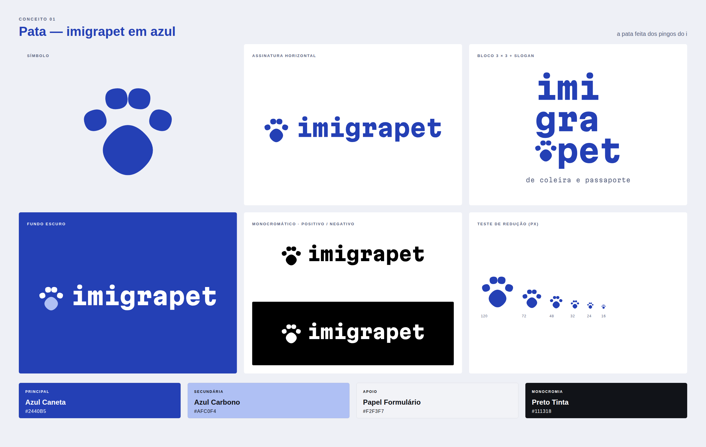
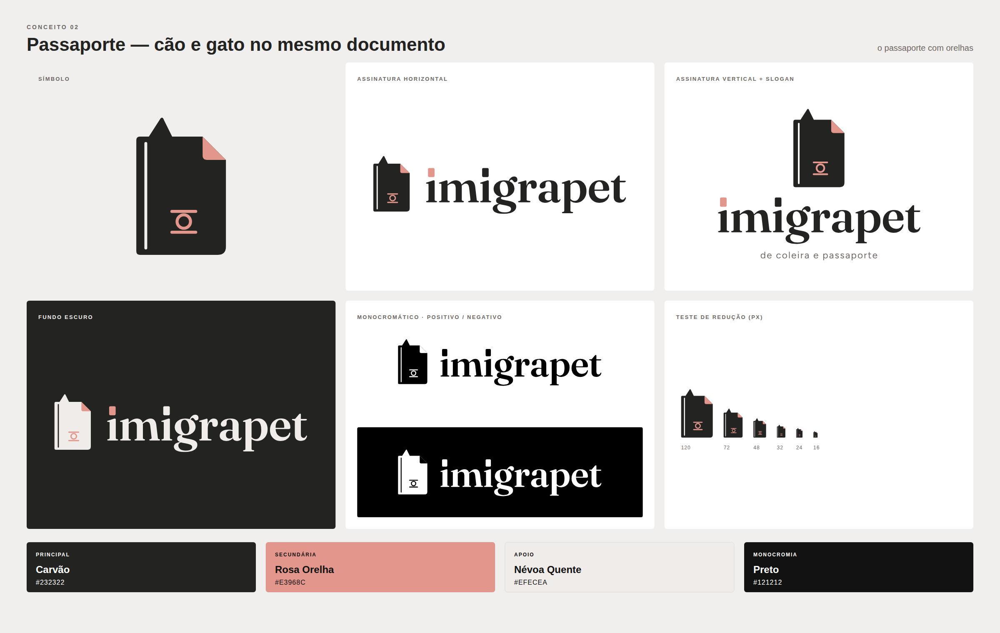
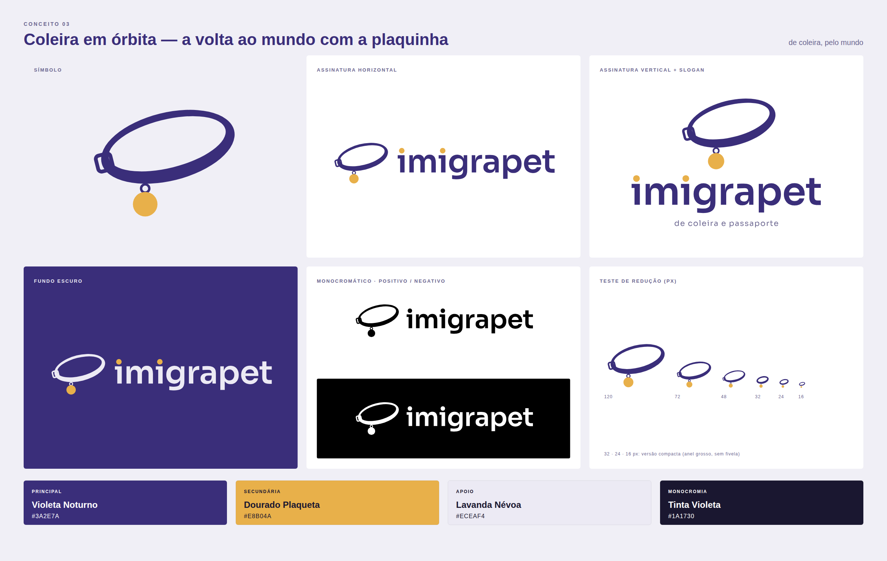

# Imigrapet · rodada 4: revisão com o seu retorno

Apresentação completa: [`apresentacao.html`](apresentacao.html) (abrir no navegador).

| Seu pedido | O que foi feito |
|---|---|
| **Modelo 1:** "gostei, mas acrescente uma pata original como símbolo, junto com imigrapet soletrado, e essa identidade azul" | Mantive o azul e o bloco 3 × 3 e criei uma **pata própria**, feita dos **pingos do i** da fonte da marca. Ela vira o símbolo ao lado de `imigrapet` por extenso e ocupa a casa vazia do bloco, onde o pet estava. |
| **Modelo 2:** "substitua o focinho por um passaporte para animais criativo, que complete a fonte personalizada do imigrapet" | Criei um **passaporte com orelhas**: uma de gato (a ponta) e uma de cão (o canto dobrado, em rosa). Na capa entra o símbolo real do passaporte eletrônico. O wordmark foi personalizado com **pingos em forma de mini-passaporte**. |
| **Modelo 3:** "aprimore, ficou meio estranho, mude de ideia" | Descartei o P-bandeira. A ideia nova é a **coleira em órbita**: uma coleira com a plaquinha dourada, inclinada como a órbita de uma viagem ao redor do mundo. |

Os três modelos agora contam juntos a promessa da marca: **a pata** (o pet), **o passaporte** e **a coleira** ("de coleira e passaporte").

> **Higgsfield:** o saldo continua zerado, então tudo foi desenhado direto em vetor, com o texto já convertido em curvas.

---

## 01 · PATA (identidade azul)

**A pata.** Não é uma pata de banco de imagens. Ela é construída com o **pingo do "i" da própria fonte da marca** (Martian Mono ExtraBold), uma superelipse, um quadrado de cantos macios:
- os **quatro dedos** são quatro pingos do "i", com os dois de fora girados ±18° e os de dentro ±6°, formando um arco;
- a **almofada principal** é o mesmo pingo, maior e **girado 45°**. Vira um losango macio que aponta para a frente, para o caminho.

Por isso a pata "conversa" com o nome: ela é feita da mesma letra.

**Assinaturas.**
- **Horizontal:** pata + `imigrapet` por extenso, na mesma fonte.
- **Bloco 3 × 3:** `imi / gra / pet`, com o "pet" deslocado uma casa e **a pata na casa que ele deixou**. É a pegada no lugar de onde se partiu.
- **Vertical:** pata sobre `imigrapet`, com o slogan.
- **Favicon:** pata branca num quadrado azul de cantos arredondados.

**Paleta** (a mesma que você aprovou): Azul Caneta `#2440B5` · Azul Carbono `#AFC0F4` · Papel Formulário `#F2F3F7` · Preto Tinta `#111318`. No fundo azul, a almofada principal pode ir em Azul Carbono.

**Crítica.** É o conjunto mais equilibrado das quatro rodadas. O nome traz a sofisticação tipográfica, e a pata traz o reconhecimento imediato do segmento. **Risco:** pata é um signo muito usado. A diferença está na construção com os pingos da fonte, então na vetorização final não troque as superelipses por elipses comuns.

---

## 02 · PASSAPORTE (cão e gato no mesmo documento)

**O símbolo.** Um passaporte visto de frente, com lombada e cantos de capa. Ele ganha **orelhas**:
- à esquerda, uma **orelha de gato**, em ponta;
- à direita, o **canto dobrado** da capa, que é ao mesmo tempo a "orelha" de um documento manuseado e a **orelha caída de um cão**, em rosa.

Na capa entra o **símbolo do passaporte eletrônico** (o círculo entre duas linhas impresso nos passaportes com chip), em rosa. É um detalhe real do documento, sem copiar nenhum passaporte nacional.

**Fonte personalizada.** O wordmark parte da Fraunces SemiBold (licença OFL, uso comercial livre). Os pingos dos dois "i" foram **trocados por mini-passaportes**, retângulos verticais de cantos suaves; o primeiro é rosa, como o canto dobrado. Assim o símbolo e o nome falam a mesma língua. O slogan é em Figtree.

**Paleta.** Carvão `#232322` · Rosa Orelha `#E3968C` · Névoa Quente `#EFECEA` · Preto `#121212`. O rosa é só acento: 2,3:1 sobre branco, nunca como texto.

**Crítica.** É a ideia mais narrativa ("cão e gato no mesmo passaporte") e comunica a especialidade em documentação num olhar. **Riscos:** o canto dobrado lembra o ícone de "arquivo" de computador, e é a orelha de gato que desfaz essa leitura, então ela não pode ser removida. Abaixo de 24 px o emblema some e sobra a silhueta.

---

## 03 · COLEIRA EM ÓRBITA (ideia nova)

**A ideia.** A coleira é o objeto que acompanha o pet em toda a viagem. Desenhada **inclinada como uma órbita**, ela sugere a volta ao mundo sem desenhar globo nenhum. A **plaquinha dourada** pendurada no ponto mais baixo é a identificação, e uma **fivela** à esquerda confirma a leitura de coleira. O anel é mais grosso na frente e mais fino atrás, o que dá perspectiva sem efeito 3D.

**Construção.** O anel sai da diferença entre duas elipses (a interna é deslocada para modular a espessura: 19u na frente, 10u atrás), com inclinação de −14°. A plaquinha pende na vertical a partir do ponto mais baixo do anel já girado, como faria com a gravidade. **Versão compacta** (32 px ou menos): anel mais grosso, sem fivela e com a plaquinha maior.

**Wordmark.** Sora SemiBold (OFL), em caixa-baixa, com os **pingos do "i" em dourado**: as plaquinhas aparecem também no nome.

**Paleta.** Violeta Noturno `#3A2E7A` · Dourado Plaqueta `#E8B04A` · Lavanda Névoa `#ECEAF4` · Tinta Violeta `#1A1730`. Contrastes: violeta sobre branco 11,3:1 ✔; dourado sobre violeta 5,8:1 ✔; **dourado sobre branco 2,0:1 ✘** (só acento).

**Crítica.** É clara, amigável e fecha a trinca com o slogan ("de coleira"). **Riscos:** é a mais literal das três. A 16 px vira um anel com um ponto, então use a versão compacta. Se a elipse for achatada demais, lê como disco voador ou auréola: mantenha a proporção de 2:1.

---

## Avaliação e recomendação

| Critério (1–5) | Pata | Passaporte | Coleira |
|---|:-:|:-:|:-:|
| Diferenciação | 4 | **5** | 3 |
| Memorabilidade | **5** | **5** | 4 |
| Clareza | **5** | 4 | 4 |
| Escalabilidade | **5** | 3 | 3 |
| Sofisticação | **4** | **4** | 3 |
| Aderência ao segmento | **5** | **5** | 4 |
| Potencial de identidade completa | **5** | 4 | 4 |
| **Total (de 35)** | **33** | **30** | **25** |

**Recomendação: Pata (modelo 1).** Tem o reconhecimento imediato que a cliente procurava, com uma construção que só a Imigrapet tem: a pata é feita da sua própria letra. Funciona do favicon ao uniforme, e o bloco 3 × 3 com a pegada vira uma assinatura especial para capas, posts e papelaria.

Um caminho possível é usar o **passaporte com orelhas** como **ilustração de apoio** do sistema azul (em materiais de documentação, checklists e e-mails), em vez de logo concorrente. Isso exigiria redesenhá-lo no azul.

## Orientação de vetorização (resumo)
- **Pata:** superelipses por curvas quadráticas com controle nos cantos, igual ao pingo da Martian Mono. Não troque por elipses. Rotação dos dedos: −18°, −6°, +6° e +18°; almofada principal girada 45°.
- **Passaporte:** a orelha de gato e o canto dobrado são a identidade do símbolo, então preserve ângulos e proporções. No monocromático, a dobra e o emblema viram vazados.
- **Coleira:** anel = elipse externa (100 × 50u) menos elipse interna deslocada; inclinação de −14°; plaquinha pendurada na vertical a partir do ponto mais baixo.
