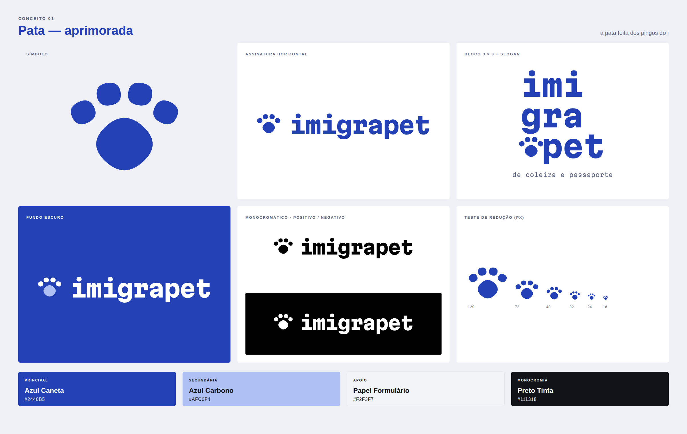
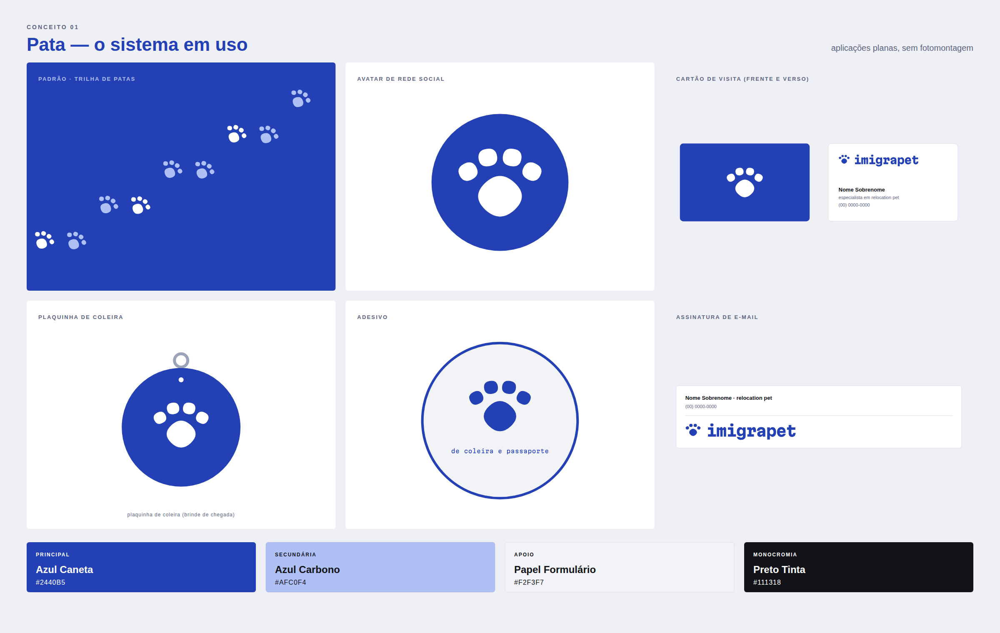
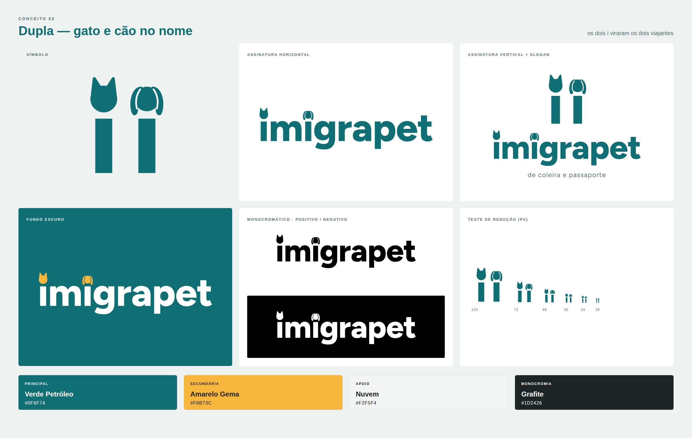
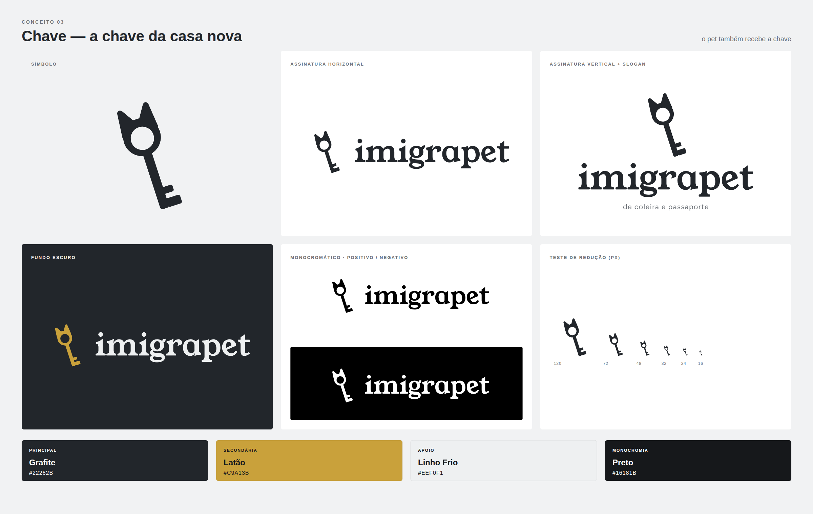

# Imigrapet · rodada 5: Pata aprimorada e dois conceitos novos

Apresentação completa: [`apresentacao.html`](apresentacao.html) (abrir no navegador).

| Seu pedido | O que foi feito |
|---|---|
| "Gostei do modelo 1 apenas, aprimore ele" | A **Pata** foi redesenhada: proporção, espaçamento, alinhamento com o nome e tipografia. Ganhou também uma **prancha de sistema** com seis aplicações. |
| "O restante, mude o conceito" | Dois conceitos novos: **Dupla** (gato e cão moram nos dois "i" do nome) e **Chave** (a chave da casa nova, com orelhas). |

> O saldo do Higgsfield continua zerado, então tudo foi desenhado direto em vetor, com o texto já convertido em curvas.

---

## 01 · PATA (aprimorada)

### O que mudou em relação à rodada 4
| Ponto | Antes | Agora |
|---|---|---|
| **Dedos** | Posição manual. Os dois do meio quase se tocavam e o conjunto pesava no topo. | Os quatro dedos ficam num **arco de raio fixo, com vãos iguais** entre si (a distância entre centros é a largura do dedo mais um vão constante). Cada dedo gira metade do seu ângulo no arco. |
| **Tamanho dos dedos** | 160 × 150u | **132 × 124u**, na proporção exata do pingo da Martian Mono (1,07 : 1) |
| **Almofada** | Superelipse girada 45°, grande | Mesma superelipse girada 45°, **um pouco menor e levemente achatada (93%)**, com respiro maior até os dedos. A pata "assenta" melhor no chão. |
| **Alinhamento com o nome** | Pata centrada no nome | A pata vai **da linha de base ao topo do pingo do "i"**: símbolo e palavra ocupam a mesma altura. |
| **Wordmark** | Martian Mono ExtraBold com espaçamento de fábrica | Espaçamento **−30/1000**. O nome fica mais compacto e mais "marca", sem perder a grade. |
| **Favicon** | Pata no quadrado com margem irregular | Pata centrada num quadrado com cantos de 16% e margem igual nos quatro lados |

A lógica continua a mesma: **os dedos são o pingo do "i" da fonte da marca, e a almofada é esse mesmo pingo girado 45°**. A pata e o nome são feitos da mesma letra.

### O sistema em uso

- **Padrão "trilha de patas":** pegadas alternadas em diagonal, em branco e Azul Carbono sobre o azul. Serve para fundos, embalagens e papel de parede de redes sociais.
- **Avatar:** pata branca no círculo azul.
- **Cartão de visita:** frente azul com a pata; verso branco com a assinatura horizontal. Os contatos são fictícios.
- **Plaquinha de coleira:** a pata gravada numa medalha real, um brinde de chegada para cada pet atendido.
- **Adesivo** com o slogan.
- **Assinatura de e-mail.**

**Paleta** (mantida): Azul Caneta `#2440B5` · Azul Carbono `#AFC0F4` · Papel Formulário `#F2F3F7` · Preto Tinta `#111318`.

---

## 02 · DUPLA (conceito novo)

**A ideia.** "imigrapet" tem **dois "i"**, e a Imigrapet leva **dois tipos de viajante**: gatos e cães. No nome, o pingo do primeiro "i" vira uma **cabeça de gato**, com orelhas em ponta, e o pingo do segundo vira uma **cabeça de cão**, com orelhas longas e caídas. O símbolo é o **par "ii"** tirado do próprio nome: dois viajantes lado a lado.

**Construção.**
- O wordmark é Figtree ExtraBold (licença OFL), uma sans geométrica e amigável, com espaçamento −10.
- As cabeças são círculos do tamanho do pingo original com as orelhas somadas. O cão tem um vazado fino separando a orelha da cabeça, para ler como orelha caída.
- O slogan é Figtree Regular, tracking +60.

**Paleta.** Verde Petróleo `#0F6F74` · Amarelo Gema `#F6B73C` · Nuvem `#F2F5F4` · Grafite `#1D2426`. Contrastes: petróleo sobre branco 5,9:1 ✔. O amarelo é só para as cabeças sobre o petróleo (3,3:1, um elemento gráfico) e nunca para texto sobre branco (1,8:1 ✘).

**Crítica.**
- **Força:** é a mais **afetiva** e **inclusiva**, porque cita cães e gatos ao mesmo tempo. O nome já é o logo, e o detalhe se descobre na segunda olhada.
- **Riscos:**
  - É a mais próxima de um mascote, e pode ficar infantil se as cabeças crescerem.
  - Em tamanhos pequenos as cabeças viram pingos comuns. Isso não é problema: continua lendo "imigrapet".
  - O símbolo "ii" sozinho é o que menos se sustenta como avatar.

---

## 03 · CHAVE (conceito novo)

**A ideia.** Relocation é, no fim, **mudar de casa**, e toda mudança termina com uma chave na mão. A Imigrapet entrega **a chave da casa nova também para o pet**. O símbolo é uma chave cuja **argola tem orelhas**: a cabeça da chave vira a cabeça do pet. Levemente inclinada (−18°), ela parece estar entrando na fechadura.

**Construção.**
- Argola (círculo cheio com furo de 62% do raio) com orelhas em ponta arredondada, haste reta e dois dentes.
- O furo grande é deliberado. Com um furo pequeno, a argola parecia um rosto com um olho só.
- O wordmark é Young Serif (OFL), uma serifada pesada e acolhedora, com cara de "lar", espaçamento −8.
- O slogan é Figtree Regular.

**Paleta.** Grafite `#22262B` · Latão `#C9A13B` (o metal das chaves) · Linho Frio `#EEF0F1` · Preto `#16181B`. Contrastes: grafite sobre branco 15,2:1 ✔; latão sobre grafite 6,3:1 ✔; latão sobre branco 2,4:1 ✘. A chave fica em latão só sobre o grafite.

**Crítica.**
- **Força:** a história é forte e fácil de contar ("a chave da casa nova do seu pet"), e é a mais **sofisticada e adulta** das três.
- **Riscos:**
  - "Chave" é um símbolo muito usado por **imobiliárias**; são as orelhas que mudam o segmento.
  - A 16 px os dentes somem e fica uma "argola com orelhas".
  - As orelhas são de gato. Para incluir cães, dá para testar uma variação com uma orelha caída.

---

## Avaliação e recomendação

| Critério (1–5) | Pata | Dupla | Chave |
|---|:-:|:-:|:-:|
| Diferenciação | 4 | **5** | 4 |
| Memorabilidade | **5** | **5** | 4 |
| Clareza | **5** | 4 | 4 |
| Escalabilidade | **5** | 3 | 3 |
| Sofisticação | **4** | 3 | **4** |
| Aderência ao segmento | **5** | **5** | 3 |
| Potencial de identidade completa | **5** | 4 | 4 |
| **Total (de 35)** | **33** | **29** | **26** |

**Recomendação: seguir com a Pata.** Ela é a escolha da cliente e está pronta para virar identidade. Com a prancha de sistema, já dá para ver a marca funcionando no cartão, no avatar, na plaquinha e no e-mail.

**Próximos passos:** (1) vetorização final (as superelipses são curvas quadráticas com controle nos cantos, iguais ao pingo da Martian Mono; não troque por elipses); (2) prova de impressão do Azul Caneta com o Pantone definido no guia físico; (3) busca de anterioridade no INPI; (4) manual da marca com área de proteção (a altura de um dedo da pata) e tamanhos mínimos (16 px / 6 mm).
