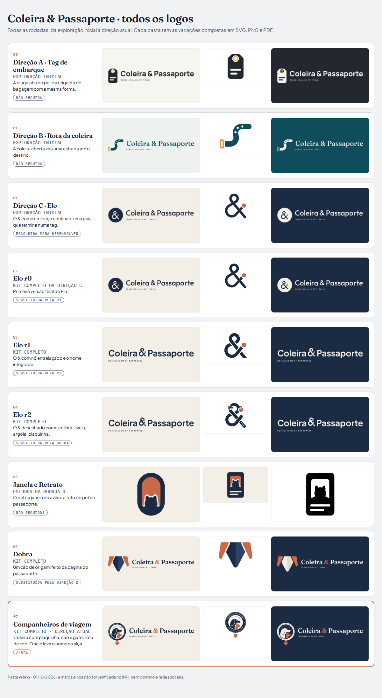

# work · todos os logos da Coleira & Passaporte

Esta pasta guarda todos os logos que foram feitos, da exploração inicial à direção atual. Cada rodada vem com todas as variações.

Para ver tudo de uma vez, abra a [`visao-geral.png`](visao-geral.png) (também em PDF e HTML).

## Pastas

| Pasta | O que é | Status | Arquivos |
| --- | --- | --- | --- |
| `01-exploracao-inicial/` | As três direções da primeira rodada: A · Tag de embarque, B · Rota da coleira, C · Elo | C escolhida; A e B não seguidas | 54 |
| `02-elo-r0/` | Kit completo da direção C (Elo), primeira versão | Substituída pela r1 | 122 |
| `03-elo-r1/` | Elo r1: o & com nó entrelaçado | Substituída pela r2 | 158 |
| `04-elo-r2/` | Elo r2: o & desenhado como coleira (fivela, argola, plaquinha) | Substituída pela Dobra | 230 |
| `05-estudos-janela-e-retrato/` | Estudos da rodada 3: o pet na janela do avião e a foto do pet no passaporte | Não seguidos | 8 |
| `06-dobra/` | Dobra: cão de origami feito da página do passaporte (com gato e coelho) | Substituída pela direção E | 200 |
| `07-companheiros-de-viagem-atual/` | Direção atual: coleira com plaquinha, cão e gato, rota de voo e o selo com o nome na alça | **Atual** | 182 |
| `apresentacoes/` | A apresentação de cada rodada, em HTML, PDF e PNG | Registro | 15 |

## Como os arquivos estão organizados

Dentro de cada kit (pastas 02, 03, 04, 06 e 07):

- `svg/`: vetor, com o nome em curvas e fundo transparente. Use para editar ou para a gráfica.
- `pdf/`: vetor para impressão, sem imagem embutida.
- `png/`: imagem com fundo transparente, para tela.
- `avatar/`: quadrados com fundo, prontos para Instagram e WhatsApp.
- `favicon/`: ícone de site (ICO, SVG e PNG de 16 a 512 px).
- `elementos/` (quando existe): peças de apoio, como plaquinha, rota, faixa ou orelha.

O fim do nome de cada arquivo indica a versão de cor:

| Sufixo | Versão |
| --- | --- |
| `_cor` | Cores da marca, para fundo claro |
| `_negativo` | Para fundo escuro |
| `_preto` | Uma cor, preto |
| `_branco` | Uma cor, branco (para fundo escuro) |
| `_cinza` | Escala de cinza |
| `_uma-cor` | Uma cor, Azul Passaporte |

As pastas de estudo têm menos versões, só em SVG e PNG: a 01 em `_cor`, `_negativo` e `_preto`; a 05 em `_cor` e `_preto`.

## De onde veio cada pasta

Tudo foi copiado do histórico do repositório, sem nenhuma alteração. A pasta `07-companheiros-de-viagem-atual/` é idêntica a `identidade-visual/final/`.

| Pasta | Commit de origem |
| --- | --- |
| 01, 02 | `58f7e5a` |
| 03 | `d6bf88c` |
| 04 | `07f2724` |
| 05, 06 | `4c8654e` |
| 07 | `dd2dee0` |

Os estudos gerados por IA na primeira rodada ficaram no projeto do Higgsfield “Coleira & Passaporte — Identidade Visual”. Eles não estão aqui porque as imagens não puderam ser baixadas. De qualquer forma, nenhum logo final veio dessas imagens.

## Antes de usar comercialmente

Nenhuma destas versões teve a marca verificada. Ainda é preciso checar o INPI, o domínio e os perfis nas redes sociais.
